# StyloBot — Architecture (C4 Component)

> Grounded in the code: FOSS core mapped from `~/RiderProjects/stylobot` (Ephemeral signals/atoms engine),
> commercial surface from this repo's `src/`. Each component is coloured by its **owning agent**
> (`agent_color(<prefix>)`), so this diagram doubles as the fleet **ownership map** — grey = no owner yet.
> Styloagent renders the fenced block live and clickably. Living document; re-derived as the fleet reports back.

```mermaid
C4Component
    title StyloBot — Component Architecture (FOSS enforcement plane + Commercial layer)

    Person(operator, "Operator / Team", "Runs StyloBot gateways at scale")
    Person(customer, "Customer", "Buys per-domain licences")

    System_Ext(traffic, "Web traffic", "Bots + humans hitting protected apps")
    System_Ext(upstream, "Protected apps", "Marketing site, dashboard host, customer apps — own ZERO StyloBot state")
    System_Ext(stripe, "Stripe", "Checkout + billing")
    System_Ext(keycloak, "Keycloak", "OIDC / portal auth")
    System_Ext(llmapi, "LLM endpoints", "OpenAI / Anthropic / Azure / Ollama gemma4")

    Boundary(foss, "FOSS StyloBot — enforcement plane (repo: ~/RiderProjects/stylobot)") {
        Component(gateway, "StyloBot Gateway", "Stylobot.Gateway / YARP", "THE edge. Boots BotDetectionModule (IStyloflowWebModule) + YAML manifests. Pipeline: TLS-capture -> UseBotDetection -> UseDetectionPolicies -> persistence -> Honeypot -> MapReverseProxy. No proxy/ingress in front.")
        Component(pipeline, "Detection pipeline", "Ephemeral atoms + signals", "BotDetectionOrchestrator (scoped, owns per-request SignalSink) -> DetectionEngine (singleton) runs wave-ordered IDetectorAtoms -> DetectionLedger -> Signature/ResponseCoordinator. Verdict via SignatureRiskVerdictComposer.Compose -> RiskBand | ThreatBand | RiskProfileLabel (derived, never cached). ScheduleCoordinator ticks, not BackgroundServices. No bypasses.")
        Component(classifier, "Identity + centroids", "archetypes / pgvector / Leiden", "IdentityArchetypeRegistry.FindNearest (masked cosine + Mahalanobis variance) over IdentityArchetype centroids; per-fingerprint centroid seeded from archetype then replaced by LeidenClustering community means; BotClusterType incl. Safe. 3 tiers: L1 match / L2 SessionAggregate / L3 Fingerprint. Centroids, never rules.")
        Component(fossui, "Dashboard UI", "Mostlylucid.BotDetection.UI (RCL)", "Razor Class Library (NuGet, _content/ assets). AddStyloBotDashboard / AddStyloBotUI / AddStyloBotDashboardRemote (thin-client via GatewayApiClient + X-SB-Api-Key). DashboardPageManifest -> widget catalog; DashboardFreshnessBeacon + SignalR hub. SSR + HTMX OOB, no polling.")
        Component(wba, "Web Bot Auth", "RFC 9421", "Rfc9421SignatureVerifier + IPublicKeyRegistry + ISignatureValidator behind ITokenVerifier; WebBotAuthApprovalAtom extracts headers -> webbotauth signals (never raw sig bytes). Standby (wba- / wba-atom-).")
    }

    Boundary(cxenf, "Commercial enforcement (runs in the per-SKU AOT GatewayHost)") {
        Component(plugin, "Commercial Gateway Plugin", "Stylobot.Commercial.GatewayPlugin", "Implements/Replaces FOSS seams via DI: ControlPlaneConfigurationSource (IConfigurationOverrideSource + WatchAsync hot-reload), IDetectionArchive, IFingerprintStore, IPatternReputationCache, I*CentroidStore, IIdentityAnchorIndex (->pgvector), ITokenVerifier (licence-wrapping). Editors + fingerprint-rename backplane. JWT paid-gate, fails-open. (caps- capability-token atom lives here, paused.)")
        ComponentDb(persistence, "Persistence", "Postgres+pgvector (Dapper)", "Stylobot.Commercial.Persistence.{Postgres|Sqlite|MySql|SqlServer}. Config, fleet, session vectors (HNSW), history. StoreUniformityOptions + .Replace(Func<DbConnection>) enforce ONE db — no shadow SQLite store.")
        ComponentDb(cachecluster, "Redis cache + cluster", "Cache.Redis / Cluster.Redis", "Cross-gateway reputation, config pub/sub push, cluster backplane, leader election, session ownership, cross-instance signatures (AesGcm protected).")
        Component(llm, "Commercial LLM providers", "Llm.{OpenAi,Anthropic,AzureOpenAi}", "ILlmEscalationProvider impls + LlmEscalationBudget guard. Escalation for high-value decisions.")
    }

    Boundary(cxcp, "Commercial control plane + services (this repo)") {
        Component(controlplane, "Control Plane API", "Stylobot.Commercial.ControlPlane", "/api/config, /api/fleet, /health. IConfigOverrideStore, IControlPlaneClient, IFleetQuery, IEffectivePolicyResolver, IPolicyStore. Staged config rollout + fleet telemetry.")
        Component(domains, "Domains, Licensing & Billing", "Domains / Licensing / Billing", "Per-domain licensing (ILicensedDomainStore, IDomainGroupStore), IStyloBotLicenseGate JWT, Stripe checkout -> signed StyloFlow JWT licence.")
        Component(intel, "Intelligence & Ops services", "ThreatIntel / Reporting / Compliance / Tuner / Guardian", "Threat-feed poller + fingerprint feed, scheduled report packs, compliance surface, detector tuner, operator-correction store (feeds the verdict Correction prior).")
    }

    Boundary(website, "Marketing Website — site-commercial container") {
        Component(membership, "Membership + Ecommerce", "Keycloak + Stripe", "Signup, portal auth, edit-mode gating; cart/checkout -> per-domain licence issuance.")
        Component(dashread, "Dashboard read path", "SSR + SignalR + HTMX", "Widget ledger, batch composition, SSR-first; signal -> invalidate -> HTMX OOB morph (no polling). Investigation / shape-search view (GhostShape, RadarShape, IIpSearchIndexStore). Reads fresh over REST.")
        Component(dashwrite, "Dashboard write path / config editor", "HTMX + Alpine", "Apply-policy controls, effective-policy stack, config editor. Commercial-only hot-reload; demo vs owner gating.")
    }

    Boundary(platform, "Platform & Delivery") {
        Component(delivery, "Build & Deploy pipeline", "Maxo -> registry -> k8s Helm", "Per-SKU AOT image build -> registry -> staging.stylobot.net -> prod microk8s (digest-pinned Helm, guarded deploy).")
        Component(platsec, "Platform security", "Harbor / Keycloak / cluster", "Harbor registry, Keycloak OIDC, cluster hardening + security findings.")
    }

    Rel(operator, dashread, "monitors fleet + verdicts", "HTTPS")
    Rel(operator, dashwrite, "edits live config", "HTTPS")
    Rel(customer, membership, "buys per-domain licence", "HTTPS")

    Rel(traffic, gateway, "all requests — direct, no ingress in front", "HTTPS/TLS")
    Rel(gateway, upstream, "proxies allowed traffic + decision headers", "HTTP")
    Rel(gateway, pipeline, "runs detection inline")
    Rel(pipeline, classifier, "scores fingerprints vs centroids")
    Rel(gateway, plugin, "loads via DI — commercial .Replace of FOSS seams")

    Rel(plugin, persistence, "ONE db: .Replace Func<DbConnection> + StoreUniformity", "SQL")
    Rel(plugin, cachecluster, "reputation + config reload", "pub/sub")
    Rel(plugin, controlplane, "heartbeats + metrics; pulls config", "REST")
    Rel(plugin, llm, "escalation")
    Rel(llm, llmapi, "calls", "HTTPS")

    Rel(controlplane, persistence, "reads / writes", "SQL")
    Rel(controlplane, cachecluster, "config push", "pub/sub")
    Rel(domains, persistence, "licences + domain groups", "SQL")
    Rel(intel, persistence, "feeds + corrections + reports", "SQL")
    Rel(domains, stripe, "billing", "HTTPS")

    Rel(dashread, controlplane, "reads fresh — compute-at-read, no cache", "REST")
    Rel(dashread, fossui, "AddStyloBotDashboardRemote — real components + recorded data")
    Rel(dashwrite, controlplane, "applies config overrides", "REST")
    Rel(membership, keycloak, "auth", "OIDC")
    Rel(membership, domains, "issues licence")

    Rel(delivery, gateway, "builds + deploys images")
    Rel(platsec, keycloak, "configures OIDC + hardening")

    UpdateElementStyle(gateway, $bgColor="#E57373", $fontColor="#111111", $borderColor="#E57373")
    UpdateElementStyle(pipeline, $bgColor="#E57373", $fontColor="#111111", $borderColor="#E57373")
    UpdateElementStyle(classifier, $bgColor="#E57373", $fontColor="#111111", $borderColor="#E57373")
    UpdateElementStyle(fossui, $bgColor="#E57373", $fontColor="#111111", $borderColor="#E57373")
    UpdateElementStyle(wba, $bgColor="#DCE775", $fontColor="#111111", $borderColor="#DCE775")
    UpdateElementStyle(plugin, $bgColor="#A1887F", $fontColor="#111111", $borderColor="#A1887F")
    UpdateElementStyle(persistence, $bgColor="#A1887F", $fontColor="#111111", $borderColor="#A1887F")
    UpdateElementStyle(cachecluster, $bgColor="#A1887F", $fontColor="#111111", $borderColor="#A1887F")
    UpdateElementStyle(llm, $bgColor="#9E9E9E", $fontColor="#111111", $borderColor="#9E9E9E")
    UpdateElementStyle(controlplane, $bgColor="#A1887F", $fontColor="#111111", $borderColor="#A1887F")
    UpdateElementStyle(domains, $bgColor="#A1887F", $fontColor="#111111", $borderColor="#A1887F")
    UpdateElementStyle(intel, $bgColor="#9E9E9E", $fontColor="#111111", $borderColor="#9E9E9E")
    UpdateElementStyle(membership, $bgColor="#A1887F", $fontColor="#111111", $borderColor="#A1887F")
    UpdateElementStyle(dashread, $bgColor="#4DB6AC", $fontColor="#111111", $borderColor="#4DB6AC")
    UpdateElementStyle(dashwrite, $bgColor="#F06292", $fontColor="#111111", $borderColor="#F06292")
    UpdateElementStyle(delivery, $bgColor="#AED581", $fontColor="#111111", $borderColor="#AED581")
    UpdateElementStyle(platsec, $bgColor="#4FC3F7", $fontColor="#111111", $borderColor="#4FC3F7")

    UpdateLayoutConfig($c4ShapeInRow="3", $c4BoundaryInRow="2")
```

## Ownership map (colour = owning agent)

| Colour | Agent | Owns |
|---|---|---|
| 🔴 `#E57373` | `foss-` | Gateway, detection pipeline, identity/centroids, FOSS dashboard RCL |
| 🟡 `#DCE775` / `#7986CB` | `wba-` / `wba-atom-` | Web Bot Auth verifier + extractor atom (standby) |
| 🟤 `#A1887F` | `mae-` | Membership + ecommerce; Domains/Licensing/Billing |
| 🟤 `#A1887F` | `overview-` | Gateway plugin, control-plane API, Persistence, Redis/cluster — **cross-cutting backend, no dedicated specialist** |
| 🟢 `#4DB6AC` | `dash-` | Dashboard read path + investigation/shape-search |
| 🩷 `#F06292` | `edit-` | Dashboard write path / config editor |
| 🟩 `#AED581` | `deploy-` | Build & deploy pipeline |
| 🔵 `#4FC3F7` | `prod-` | Platform security |
| ⚪ `#9E9E9E` | **(none)** | Commercial LLM providers; Intelligence & Ops (ThreatIntel, Reporting, Compliance, Tuner, Guardian) |

## Hard invariants encoded here (`overview-` owns these)

1. **Gateway *is* the reverse proxy** — traffic enters the gateway directly; no Traefik / nginx / Ingress / CF tunnel in front on prod (direct-VPS microk8s). *(traffic → gateway)*
2. **Upstream owns zero StyloBot state** — protected apps get decisions + headers and read over REST; all state lives in the enforcement + commercial data plane. *(upstream is `System_Ext`)*
3. **No bypasses for detection issues** — misclassified legit traffic is fixed in the pipeline (signal / centroid / archetype), never an allow-always policy. *(pipeline)*
4. **Centroids, not rules** — `IdentityArchetypeRegistry.FindNearest` + drift + Leiden; YAML only *seeds* centroids. *(classifier)*
5. **One DB** — `.Replace(Func<DbConnection>)` + `StoreUniformityOptions`; the SQLite `WriteBehindLfuStore` default must never shadow-write alongside Postgres. *(plugin → persistence)*
6. **No caches, freshness over locality** — the dashboard derives fresh from the owner at read (compute-at-read); verdict bands are composed not cached. *(dashread → controlplane)*
7. **Hot-reload / config-write is commercial-only** — FOSS has `/admin/reload` + `YamlPolicyRuleStore`; the DB + fleet + UI apply surface is commercial. *(dashwrite, plugin, cachecluster)*
8. **Paid-vs-OSS licence gate, fails-open** — `IStyloBotLicenseGate` JWT unlocks capabilities never counts; on expiry customers export config to FOSS. *(plugin, domains)*
9. **Dogfood, no demoware** — the marketing site embeds the real FOSS RCL via `AddStyloBotDashboardRemote` showing recorded data. *(dashread → fossui)*
10. **SSR-first dashboard** — SSR first paint; `DashboardFreshnessBeacon` + SignalR invalidation + HTMX OOB swap (Alpine for interactions), never timed polling. *(dashread, dashwrite)*

## Open questions for the fleet

- **The roster under-covers the code.** `Stylobot.Commercial.{ThreatIntel, Reporting, Compliance, Tuner, Guardian, Identity}` and the commercial **LLM providers** have no owning agent (grey above). The commercial backend (plugin / control-plane / persistence / cache-cluster) is held by `overview-`. These want dedicated owners (a `plane-`/`cp-` backend agent; an `intel-`/`feed-` services agent) if the work heats up.
- **Seam names reconciled.** CLAUDE.md's abstraction table (`IConfigurationSource`/`IFleetReporter`/`ISessionStore`) is a simplification — the real FOSS seams are `IConfigurationOverrideSource`, `IDetectionArchive`, `IFingerprintStore`, `IPatternReputationCache`, `Func<DbConnection>`, `I*CentroidStore`, `ITokenVerifier`; the commercial side names them `IConfigOverrideStore`/`IControlPlaneClient`/`IFleetQuery`. Worth a CLAUDE.md fix.
- **`overview-` and `mae-` share the hex `#A1887F`** — `agent_color()` hashes both to brown. Legible today (different boundaries); override if the map gets busy.
- **Depth of the commercial C4 is provisional** — the FOSS core is mapped from code; the commercial groupings (esp. `intel`, `domains`) are inventory-level. Split further when a specialist takes each area.
