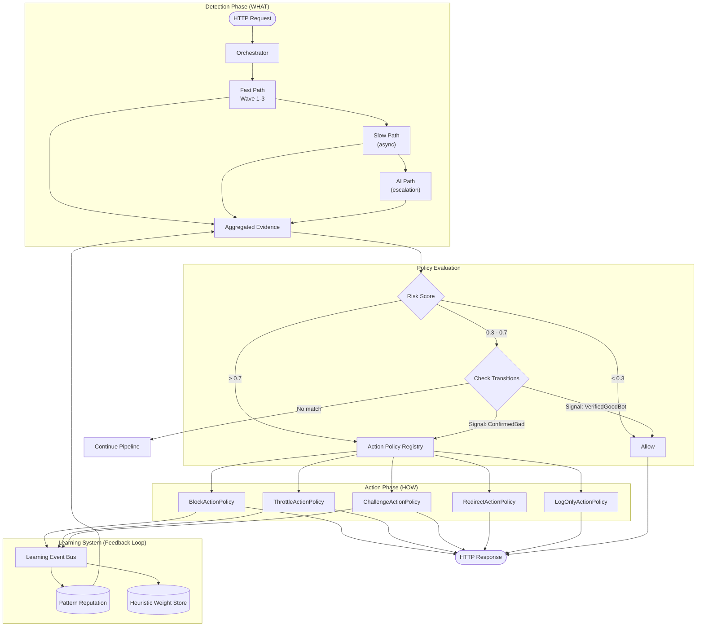
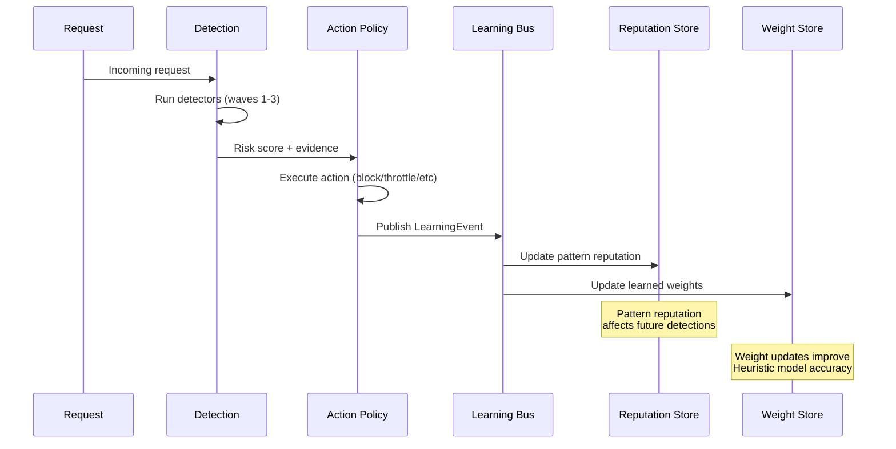
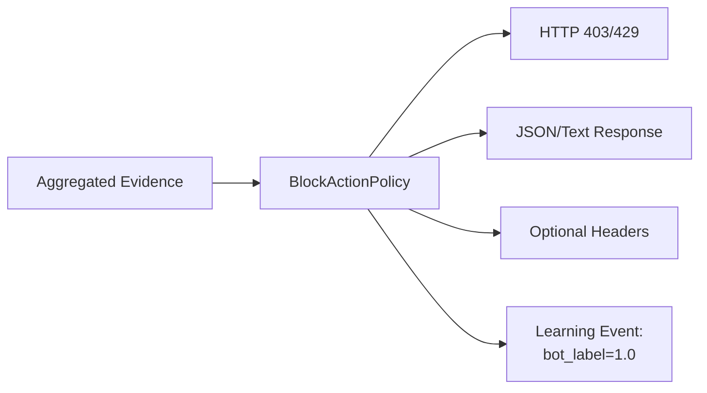
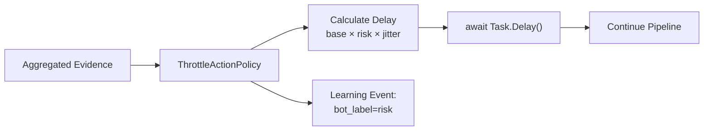
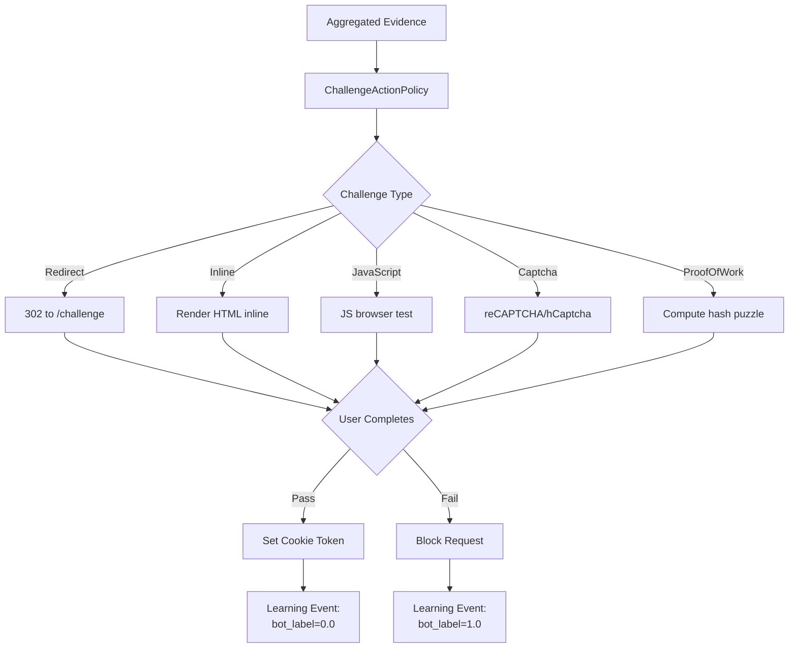
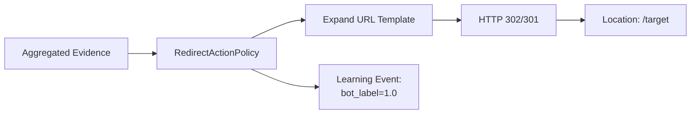
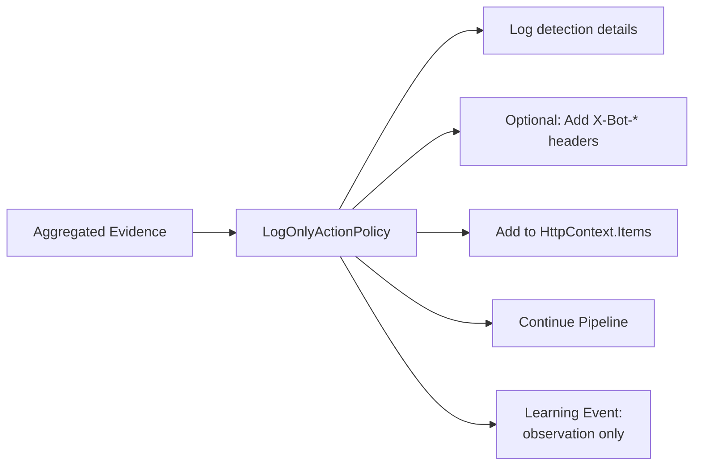

# Action Policies

Action policies define **HOW** to respond when a bot is detected. They are separate from detection policies (which
define **WHAT** to detect) for maximum composability.

## Architecture Overview



## Quick Start

### Two Lines of Code

```csharp
// Minimal setup - uses built-in policies with learning enabled
builder.Services.AddBotDetection();
app.UseBotDetection();
```

### Recommended Production Configuration

```json
{
  "BotDetection": {
    "BotThreshold": 0.7,
    "BlockDetectedBots": true,
    "DefaultActionPolicyName": "throttle-stealth",

    "EnableAiDetection": true,
    "AiDetection": {
      "Provider": "Heuristic",
      "Heuristic": {
        "Enabled": true,
        "EnableWeightLearning": true
      }
    },

    "Learning": {
      "Enabled": true,
      "LearningRate": 0.1,
      "EnableDriftDetection": true
    },

    "ActionPolicies": {
      "api-protection": {
        "Type": "Throttle",
        "BaseDelayMs": 500,
        "MaxDelayMs": 10000,
        "ScaleByRisk": true,
        "JitterPercent": 0.5,
        "IncludeHeaders": false,
        "Description": "Stealth throttle for API endpoints"
      }
    },

    "PathPolicies": {
      "/api/login": "strict",
      "/api/checkout/*": "strict",
      "/api/*": "default"
    }
  }
}
```

## Integration with Learning System

Action policies are tightly integrated with the learning and reputation system. When an action is taken, it feeds back
into the learning loop:



### How Actions Feed Learning

| Action        | Learning Effect                                      |
|---------------|------------------------------------------------------|
| **Block**     | Strong positive label (1.0) for bot patterns         |
| **Throttle**  | Moderate positive label (0.7-0.9 based on risk)      |
| **Challenge** | Label based on challenge result (pass=0.0, fail=1.0) |
| **LogOnly**   | Weak label for shadow mode analysis                  |
| **Allow**     | Negative label (0.0) for verified good patterns      |

### Enabling Learning

Learning is enabled by default but can be configured:

```json
{
  "BotDetection": {
    "Learning": {
      "Enabled": true,
      "LearningRate": 0.1,
      "MaxSupport": 1000,
      "ScoreDecayTauHours": 168,
      "SupportDecayTauHours": 336,
      "EnableDriftDetection": true,
      "DriftThreshold": 0.05
    }
  }
}
```

See [learning-and-reputation.md](learning-and-reputation.md) for full details.

---

## Built-In Action Policies

These policies are available without configuration:

### Block Policies

| Name          | Status | Description                        | Learning Impact  |
|---------------|--------|------------------------------------|------------------|
| `block`       | 403    | Default block with "Access denied" | Strong bot label |
| `block-hard`  | 403    | Minimal response                   | Strong bot label |
| `block-soft`  | 429    | Too Many Requests style            | Strong bot label |
| `block-debug` | 403    | Includes risk score details        | Strong bot label |

### Throttle Policies

| Name                  | Delay       | Description             | Learning Impact    |
|-----------------------|-------------|-------------------------|--------------------|
| `throttle`            | 500-5000ms  | Moderate, risk-scaled   | Moderate bot label |
| `throttle-gentle`     | 200-1000ms  | High jitter             | Weak bot label     |
| `throttle-moderate`   | 500-5000ms  | Risk-scaled             | Moderate bot label |
| `throttle-aggressive` | 1-30s       | Exponential backoff     | Strong bot label   |
| `throttle-stealth`    | 500-10000ms | No headers, high jitter | Moderate bot label |

### Challenge Policies

| Name                | Type          | Description                | Learning Impact |
|---------------------|---------------|----------------------------|-----------------|
| `challenge`         | Redirect      | Default redirect challenge | Based on result |
| `challenge-captcha` | CAPTCHA       | reCAPTCHA/hCaptcha         | Based on result |
| `challenge-js`      | JavaScript    | Browser verification       | Based on result |
| `challenge-pow`     | Proof of Work | Computational puzzle       | Based on result |

### Redirect Policies

| Name                | Target    | Description          | Learning Impact  |
|---------------------|-----------|----------------------|------------------|
| `redirect`          | /blocked  | Simple redirect      | Strong bot label |
| `redirect-honeypot` | /honeypot | Silent trap          | Strong bot label |
| `redirect-tarpit`   | /tarpit   | Slow response        | Strong bot label |
| `redirect-error`    | /error    | Error page with info | Strong bot label |

### Log-Only Policies

| Name      | Level | Description              | Learning Impact  |
|-----------|-------|--------------------------|------------------|
| `logonly` | Info  | Log and allow            | Observation only |
| `shadow`  | Info  | Shadow mode with headers | Observation only |
| `debug`   | Debug | Full evidence logging    | Observation only |

---

## Policy Types

### BlockActionPolicy

Returns an HTTP error status, ending the request.



**Configuration Options:**

| Option             | Type   | Default            | Description                       |
|--------------------|--------|--------------------|-----------------------------------|
| `StatusCode`       | int    | 403                | HTTP status code (403, 429, etc.) |
| `Message`          | string | "Access denied"    | Response body message             |
| `ContentType`      | string | "application/json" | Response content type             |
| `IncludeRiskScore` | bool   | false              | Include risk details in body      |
| `IncludeHeaders`   | bool   | false              | Add X-Bot-* headers               |
| `Headers`          | dict   | {}                 | Additional custom headers         |

**JSON Configuration:**

```json
{
  "BotDetection": {
    "ActionPolicies": {
      "hardBlock": {
        "Type": "Block",
        "StatusCode": 403,
        "Message": "Access denied - bot detected",
        "IncludeRiskScore": false,
        "Headers": {
          "X-Block-Reason": "bot-detection"
        },
        "Description": "Hard block for confirmed bots",
        "Tags": ["production", "strict"]
      }
    }
  }
}
```

**Code Configuration:**

```csharp
services.AddBotDetection(options =>
{
    options.ActionPolicies["hardBlock"] = new ActionPolicyConfig
    {
        Type = "Block",
        StatusCode = 403,
        Message = "Access denied - bot detected",
        IncludeRiskScore = false,
        Headers = new Dictionary<string, string>
        {
            ["X-Block-Reason"] = "bot-detection"
        },
        Description = "Hard block for confirmed bots",
        Tags = new List<string> { "production", "strict" }
    };
});
```

---

### ThrottleActionPolicy

Delays the response to slow down bots. Includes jitter to hide throttling.



**Delay Calculation:**

```
1. Base delay from config (e.g., 500ms)
2. If ScaleByRisk: delay = base + (max - base) × risk
3. Apply jitter: delay ± (delay × jitterPercent)
4. Clamp to [min, max] range
```

**Example:**

```
BaseDelay = 500ms, MaxDelay = 10000ms, Risk = 0.8, Jitter = 0.25
ScaledDelay = 500 + (10000 - 500) × 0.8 = 8100ms
JitterRange = 8100 × 0.25 = 2025ms
FinalDelay = 8100 ± random(2025) = 6075ms to 10125ms
```

**Configuration Options:**

| Option               | Type   | Default | Description                  |
|----------------------|--------|---------|------------------------------|
| `BaseDelayMs`        | int    | 500     | Base delay in milliseconds   |
| `MinDelayMs`         | int    | 100     | Minimum delay after jitter   |
| `MaxDelayMs`         | int    | 5000    | Maximum delay                |
| `JitterPercent`      | double | 0.25    | Jitter range (0.0-1.0)       |
| `ScaleByRisk`        | bool   | true    | Scale delay by risk score    |
| `ExponentialBackoff` | bool   | false   | Increase delay per request   |
| `BackoffFactor`      | double | 2.0     | Backoff multiplier           |
| `ReturnStatus`       | bool   | false   | Return 429 vs continue       |
| `StatusCode`         | int    | 429     | Status if ReturnStatus=true  |
| `IncludeHeaders`     | bool   | false   | Include X-Throttle-* headers |
| `IncludeRetryAfter`  | bool   | true    | Include Retry-After header   |

**JSON Configuration:**

```json
{
  "BotDetection": {
    "ActionPolicies": {
      "stealthThrottle": {
        "Type": "Throttle",
        "BaseDelayMs": 500,
        "MaxDelayMs": 10000,
        "JitterPercent": 0.5,
        "ScaleByRisk": true,
        "IncludeHeaders": false,
        "Description": "Stealth throttle - bots won't know they're being slowed"
      },
      "aggressiveThrottle": {
        "Type": "Throttle",
        "BaseDelayMs": 1000,
        "MaxDelayMs": 30000,
        "ExponentialBackoff": true,
        "BackoffFactor": 2.0,
        "ReturnStatus": true,
        "StatusCode": 429,
        "IncludeRetryAfter": true,
        "Description": "Aggressive throttle with backoff"
      }
    }
  }
}
```

---

### ChallengeActionPolicy

Presents a challenge to verify the requester is human.



**Challenge Types:**

| Type          | Description                  | Difficulty | User Impact  |
|---------------|------------------------------|------------|--------------|
| `Redirect`    | Redirect to challenge page   | Low        | Page refresh |
| `Inline`      | Render challenge HTML inline | Low        | Page content |
| `JavaScript`  | Browser capability test      | Medium     | Invisible    |
| `Captcha`     | reCAPTCHA/hCaptcha           | High       | User action  |
| `ProofOfWork` | Computational puzzle         | Variable   | CPU time     |

**Proof-of-Work Difficulty:**

- Risk 0.5 = 3 leading zeros (~4K hashes, ~10ms)
- Risk 0.7 = 4 leading zeros (~65K hashes, ~100ms)
- Risk 1.0 = 5 leading zeros (~1M hashes, ~1-2s)

**Configuration Options:**

| Option                 | Type   | Default                     | Description          |
|------------------------|--------|-----------------------------|----------------------|
| `ChallengeType`        | string | "Redirect"                  | Type of challenge    |
| `ChallengeUrl`         | string | "/challenge"                | Challenge page URL   |
| `ReturnUrlParam`       | string | "returnUrl"                 | Return URL parameter |
| `UseTokens`            | bool   | true                        | Track with cookies   |
| `TokenCookieName`      | string | "bot_challenge_token"       | Cookie name          |
| `TokenValidityMinutes` | int    | 30                          | Token lifetime       |
| `ChallengeScript`      | string | "/scripts/bot-challenge.js" | JS challenge         |
| `CaptchaSiteKey`       | string | null                        | reCAPTCHA site key   |
| `CaptchaSecretKey`     | string | null                        | reCAPTCHA secret     |

**JSON Configuration:**

```json
{
  "BotDetection": {
    "ActionPolicies": {
      "captchaChallenge": {
        "Type": "Challenge",
        "ChallengeType": "Captcha",
        "CaptchaSiteKey": "your-site-key",
        "CaptchaSecretKey": "your-secret-key",
        "TokenValidityMinutes": 60,
        "Description": "CAPTCHA challenge for suspicious requests"
      },
      "powChallenge": {
        "Type": "Challenge",
        "ChallengeType": "ProofOfWork",
        "ChallengeScript": "/scripts/pow-challenge.js",
        "Description": "Computational challenge - scales with risk"
      }
    }
  }
}
```

---

### RedirectActionPolicy

Redirects the request to a different URL.



**URL Template Variables:**

| Variable         | Description              | Example   |
|------------------|--------------------------|-----------|
| `{risk}`         | Risk score (0.000-1.000) | 0.847     |
| `{riskBand}`     | Risk band name           | High      |
| `{policy}`       | Policy name              | strict    |
| `{originalPath}` | Original request path    | /api/data |

**Configuration Options:**

| Option                | Type   | Default     | Description                       |
|-----------------------|--------|-------------|-----------------------------------|
| `TargetUrl`           | string | "/blocked"  | Redirect URL (supports templates) |
| `Permanent`           | bool   | false       | 301 vs 302 redirect               |
| `PreserveQueryString` | bool   | false       | Keep original query               |
| `IncludeReturnUrl`    | bool   | false       | Add returnUrl param               |
| `ReturnUrlParam`      | string | "returnUrl" | Return URL param name             |
| `AddMetadata`         | bool   | false       | Add X-Bot-* headers               |

**JSON Configuration:**

```json
{
  "BotDetection": {
    "ActionPolicies": {
      "honeypot": {
        "Type": "Redirect",
        "TargetUrl": "/honeypot",
        "PreserveQueryString": false,
        "AddMetadata": false,
        "Description": "Silent redirect to honeypot for analysis"
      },
      "errorWithInfo": {
        "Type": "Redirect",
        "TargetUrl": "/error?reason=bot&risk={risk}&band={riskBand}&path={originalPath}",
        "AddMetadata": true,
        "Description": "Error page with detection details"
      }
    }
  }
}
```

---

### LogOnlyActionPolicy

Logs detection but allows the request through (shadow mode).



**Use Cases:**

1. **Shadow Mode Testing** - Deploy detection without blocking
2. **Gradual Rollout** - Monitor before enabling
3. **Debugging** - See detection in browser dev tools
4. **A/B Testing** - Compare block vs allow outcomes

**Configuration Options:**

| Option                   | Type   | Default       | Description              |
|--------------------------|--------|---------------|--------------------------|
| `LogLevel`               | string | "Information" | Log level                |
| `LogFullEvidence`        | bool   | false         | Include all evidence     |
| `AddResponseHeaders`     | bool   | false         | Add X-Bot-* headers      |
| `IncludeDetailedHeaders` | bool   | false         | Full detail headers      |
| `AddToContextItems`      | bool   | true          | Add to HttpContext.Items |
| `WouldBlockThreshold`    | double | 0.85          | Log "would block" above  |
| `MetricName`             | string | null          | Custom metric name       |

**JSON Configuration:**

```json
{
  "BotDetection": {
    "ActionPolicies": {
      "shadowProd": {
        "Type": "LogOnly",
        "LogLevel": "Information",
        "AddResponseHeaders": true,
        "WouldBlockThreshold": 0.85,
        "Description": "Shadow mode - log but don't block"
      },
      "debugMode": {
        "Type": "LogOnly",
        "LogLevel": "Debug",
        "LogFullEvidence": true,
        "AddResponseHeaders": true,
        "IncludeDetailedHeaders": true,
        "Description": "Full debug logging with headers"
      },
      "full-log": {
        "Type": "LogOnly",
        "LogLevel": "Debug",
        "LogFullEvidence": true,
        "AddResponseHeaders": true,
        "IncludeDetailedHeaders": true,
        "AddToContextItems": true,
        "WouldBlockThreshold": 0.7,
        "Description": "Full debug logging with all response headers - great for demos and development"
      }
    }
  }
}
```

**Full-Log Demo Policy:**

The `full-log` policy is a ready-to-use configuration for demos and development that exposes maximum visibility into the
detection process:

- **Debug-level logging** with full evidence details
- **Response headers** showing all detection metadata (X-Bot-Risk-Score, X-Bot-Detectors, X-Bot-Name, etc.)
- **HttpContext.Items** populated for downstream middleware access
- **"Would block" indicator** at 0.7 threshold for shadow mode comparison

This is used in the `Mostlylucid.BotDetection.Demo` project. Check the `/api/mode` endpoint to see if the policy is
active and inspect response headers in browser dev tools.

**Code Configuration (using preset):**

```csharp
// Use the built-in FullLog preset
var fullLogPolicy = new LogOnlyActionPolicy("full-log", LogOnlyActionOptions.FullLog);
actionRegistry.RegisterPolicy(fullLogPolicy);

// Or via options callback
services.AddBotDetection(options =>
{
    // The ActionPolicies dictionary is populated from config
    // You can also add programmatically
});
```

**Available Presets:**

| Preset                                   | LogLevel | FullEvidence | Headers        | Use Case                          |
|------------------------------------------|----------|--------------|----------------|-----------------------------------|
| `LogOnlyActionOptions.Minimal`           | Info     | No           | No             | Basic shadow mode                 |
| `LogOnlyActionOptions.Debug`             | Debug    | Yes          | Yes            | Development                       |
| `LogOnlyActionOptions.ShadowWithHeaders` | Info     | No           | Yes            | Production shadow with visibility |
| `LogOnlyActionOptions.HighRiskOnly`      | Warning  | No           | No             | Quiet, high-risk alerts only      |
| `LogOnlyActionOptions.FullLog`           | Debug    | Yes          | Yes (detailed) | Demos, full visibility            |

### Extended LogOnly Policy Types

The LogOnly policy type supports several specialized configurations for different use cases:

#### Log-to-File Policy

Writes detection events to JSON Lines files for playback and forensic analysis:

```json
{
  "ActionPolicies": {
    "log-to-file": {
      "Type": "LogOnly",
      "Enabled": true,
      "Description": "Writes detection events to JSON Lines files for playback and analysis",
      "Tags": ["production", "audit", "forensics"],
      "LogLevel": "Information",
      "LogFullEvidence": true,
      "LogDirectory": "logs/bot-detection",
      "LogFilePattern": "detections-{date}.jsonl",
      "LogOnlyBots": true,
      "LogMinConfidence": 0.5,
      "LogRetainFiles": 30
    }
  }
}
```

Use this to:

- Debug false positives by replaying exact request characteristics
- Analyze bot patterns over time
- Generate exception rules from logged data
- Feed into external analytics systems

#### Forward-to-Backend Policy

Forwards full detection data to a backend service (honeypot, analytics, SIEM):

```json
{
  "ActionPolicies": {
    "forward-to-honeypot": {
      "Type": "LogOnly",
      "Enabled": true,
      "Description": "Forwards detection data to honeypot for characterization",
      "Tags": ["honeypot", "security", "research"],
      "LogLevel": "Debug",
      "LogFullEvidence": true,
      "ForwardUrl": "http://honeypot:8080/trap",
      "ForwardMethod": "POST",
      "ForwardHeaders": {
        "X-Source": "bot-detection",
        "X-Api-Key": "honeypot-secret"
      },
      "ForwardTimeoutMs": 5000,
      "ForwardAsync": true,
      "ForwardIncludeHeaders": true,
      "ForwardIncludeReasons": true
    },
    "forward-to-analytics": {
      "Type": "LogOnly",
      "Description": "Fire-and-forget to SIEM/analytics endpoint",
      "Tags": ["analytics", "siem", "monitoring"],
      "ForwardUrl": "http://analytics:9000/events/bot-detection",
      "ForwardAsync": true,
      "ForwardIncludeHeaders": false,
      "ForwardIncludeReasons": true
    }
  }
}
```

Use this to:

- Feed honeypots with real bot traffic for characterization
- Aggregate detection events in a central analytics platform
- Send to SIEM systems for correlation with other security events

#### Passthrough Policy (Exception Handling)

Allows known-good traffic through while still logging for monitoring:

```json
{
  "ActionPolicies": {
    "passthrough-internal": {
      "Type": "LogOnly",
      "Enabled": true,
      "Description": "Allows internal monitoring through while still logging",
      "Tags": ["internal", "exceptions", "false-positives"],
      "LogLevel": "Information",
      "LogFullEvidence": true,
      "PassthroughUserAgents": [
        "InternalMonitor/.*",
        "HealthCheck/.*",
        "MyLegitimateApp/1\\.0"
      ],
      "PassthroughIps": [
        "10.0.0.0/8",
        "192.168.0.0/16",
        "172.16.0.0/12"
      ],
      "PassthroughHeaders": [
        "X-Internal-Request: true",
        "X-Service-Auth: internal-.*"
      ]
    }
  }
}
```

Use this to:

- Fix false positives without code changes
- Allow known automation/monitoring services
- Exempt internal services while still tracking them

#### Shadow Production Policy

Test detection rules before enforcement:

```json
{
  "ActionPolicies": {
    "shadow-production": {
      "Type": "LogOnly",
      "Description": "Shadow mode - logs what WOULD be blocked without blocking",
      "Tags": ["production", "shadow", "testing"],
      "LogLevel": "Information",
      "AddResponseHeaders": false,
      "WouldBlockThreshold": 0.7,
      "MetricName": "bot_detection_shadow"
    }
  }
}
```

Use this to:

- Safely test detection rules in production
- Compare "would block" vs actual traffic
- Tune thresholds before enforcement

---

## Creating Custom Action Policies

### Step 1: Implement IActionPolicy

```csharp
public class WebhookActionPolicy : IActionPolicy
{
    private readonly HttpClient _httpClient;
    private readonly WebhookOptions _options;

    public string Name { get; }
    public ActionType ActionType => ActionType.Custom;

    public WebhookActionPolicy(string name, WebhookOptions options, HttpClient httpClient)
    {
        Name = name;
        _options = options;
        _httpClient = httpClient;
    }

    public async Task<ActionResult> ExecuteAsync(
        HttpContext context,
        AggregatedEvidence evidence,
        CancellationToken cancellationToken = default)
    {
        // Send detection to external webhook
        var payload = new
        {
            timestamp = DateTime.UtcNow,
            path = context.Request.Path.Value,
            riskScore = evidence.BotProbability,
            clientIp = context.Connection.RemoteIpAddress?.ToString(),
            userAgent = context.Request.Headers.UserAgent.ToString()
        };

        await _httpClient.PostAsJsonAsync(_options.WebhookUrl, payload, cancellationToken);

        // Decide whether to block or allow
        if (evidence.BotProbability >= _options.BlockThreshold)
        {
            return ActionResult.Blocked(403, "Blocked by security policy");
        }

        return ActionResult.Allowed("Logged to webhook, allowed through");
    }
}
```

### Step 2: Create a Factory

```csharp
public class WebhookActionPolicyFactory : IActionPolicyFactory
{
    private readonly IHttpClientFactory _httpClientFactory;

    public ActionType ActionType => ActionType.Custom;

    public WebhookActionPolicyFactory(IHttpClientFactory httpClientFactory)
    {
        _httpClientFactory = httpClientFactory;
    }

    public IActionPolicy Create(string name, IDictionary<string, object> options)
    {
        var webhookOptions = new WebhookOptions
        {
            WebhookUrl = options.GetValueOrDefault("WebhookUrl")?.ToString() ?? "http://localhost:8080/webhook",
            BlockThreshold = Convert.ToDouble(options.GetValueOrDefault("BlockThreshold") ?? 0.9)
        };

        var httpClient = _httpClientFactory.CreateClient("webhook");
        return new WebhookActionPolicy(name, webhookOptions, httpClient);
    }
}
```

### Step 3: Register with DI

```csharp
services.AddHttpClient("webhook");
services.AddSingleton<IActionPolicyFactory, WebhookActionPolicyFactory>();
```

### Step 4: Configure

```json
{
  "BotDetection": {
    "ActionPolicies": {
      "webhookAlert": {
        "Type": "Custom",
        "WebhookUrl": "https://hooks.slack.com/services/xxx",
        "BlockThreshold": 0.9,
        "Description": "Send alerts to Slack and block high-risk"
      }
    }
  }
}
```

---

## Best Practices

### 1. Start with Shadow Mode

Deploy detection without blocking to measure false positive rates:

```json
{
  "BotDetection": {
    "DefaultActionPolicyName": "shadow",
    "Learning": { "Enabled": true }
  }
}
```

Monitor for 1-2 weeks, review logs, then transition to blocking.

### 2. Use Stealth Throttling

Bots often don't notice delays. Use stealth throttle to slow them without revealing detection:

```json
{
  "BotDetection": {
    "ActionPolicies": {
      "default": {
        "Type": "Throttle",
        "BaseDelayMs": 500,
        "MaxDelayMs": 10000,
        "JitterPercent": 0.5,
        "ScaleByRisk": true,
        "IncludeHeaders": false
      }
    }
  }
}
```

### 3. Layer Actions by Risk

Use policy transitions to apply different actions based on risk:

```json
{
  "BotDetection": {
    "Policies": {
      "default": {
        "Transitions": [
          { "WhenRiskExceeds": 0.95, "ActionPolicyName": "block-hard" },
          { "WhenRiskExceeds": 0.8, "ActionPolicyName": "challenge" },
          { "WhenRiskExceeds": 0.6, "ActionPolicyName": "throttle-stealth" },
          { "WhenRiskBelow": 0.3, "Action": "Allow" }
        ]
      }
    }
  }
}
```

### 4. Enable Learning for Continuous Improvement

The learning system improves detection over time:

```json
{
  "BotDetection": {
    "Learning": {
      "Enabled": true,
      "LearningRate": 0.1,
      "EnableDriftDetection": true
    },
    "EnableAiDetection": true,
    "AiDetection": {
      "Provider": "Heuristic",
      "Heuristic": {
        "Enabled": true,
        "EnableWeightLearning": true
      }
    }
  }
}
```

### 5. Use Honeypots for Intelligence

Redirect bots to honeypots to learn about their behavior:

```json
{
  "BotDetection": {
    "ActionPolicies": {
      "intel-trap": {
        "Type": "Redirect",
        "TargetUrl": "/honeypot",
        "AddMetadata": false
      }
    }
  }
}
```

Then analyze honeypot traffic to discover new bot signatures.

---

## API Reference

### IActionPolicy

```csharp
public interface IActionPolicy
{
    /// <summary>Policy name (unique identifier)</summary>
    string Name { get; }

    /// <summary>Action type category</summary>
    ActionType ActionType { get; }

    /// <summary>Execute the action policy</summary>
    Task<ActionResult> ExecuteAsync(
        HttpContext context,
        AggregatedEvidence evidence,
        CancellationToken cancellationToken = default);
}
```

### IActionPolicyRegistry

```csharp
public interface IActionPolicyRegistry
{
    IActionPolicy? GetPolicy(string name);
    IEnumerable<IActionPolicy> GetPoliciesByType(ActionType type);
    IReadOnlyDictionary<string, IActionPolicy> GetAllPolicies();
    void RegisterPolicy(IActionPolicy policy);
    IActionPolicy GetDefaultPolicy(ActionType type);
    IActionPolicy GetPolicyOrDefault(string? name, ActionType fallbackType);
}
```

### ActionResult

```csharp
public sealed record ActionResult
{
    public bool Continue { get; init; }      // Continue pipeline?
    public int StatusCode { get; init; }     // HTTP status if not continuing
    public string? Description { get; init; }
    public IReadOnlyDictionary<string, object>? Metadata { get; init; }

    // Factory methods
    public static ActionResult Blocked(int statusCode, string description);
    public static ActionResult Allowed(string? description = null);
    public static ActionResult Redirected(string url);
    public static ActionResult Challenged(string challengeType);
}
```

### ActionType

```csharp
public enum ActionType
{
    Block,      // Return HTTP error
    Throttle,   // Delay response
    Challenge,  // Verify humanity
    Redirect,   // Redirect URL
    LogOnly,    // Shadow mode
    Custom      // User-defined
}
```

### ActionPolicyConfig

```csharp
public class ActionPolicyConfig : BaseComponentConfig
{
    public string Type { get; set; }          // Block, Throttle, Challenge, Redirect, LogOnly
    public int? StatusCode { get; set; }
    public string? Message { get; set; }
    public Dictionary<string, string>? Headers { get; set; }
    // ... type-specific options
}
```

See [Actions/ActionPolicyConfiguration.cs](../Actions/ActionPolicyConfiguration.cs) for all options.