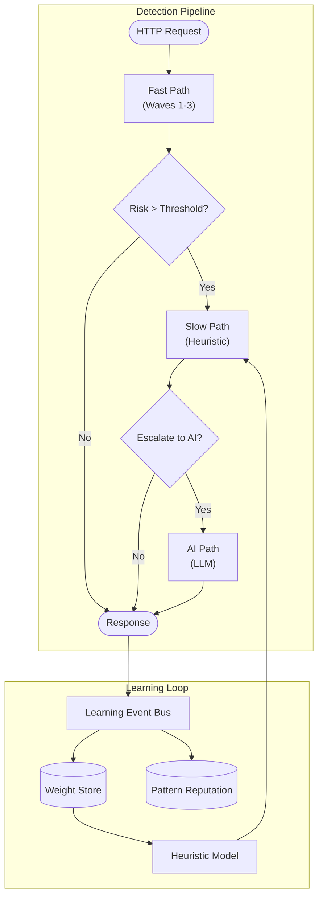
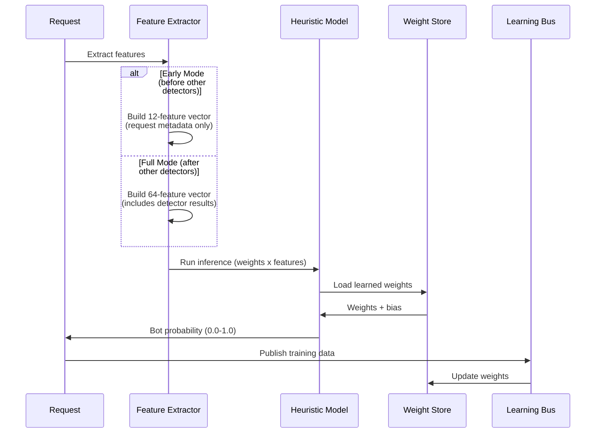
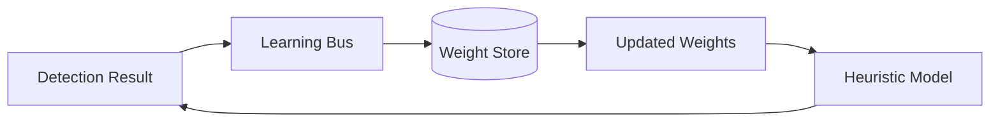
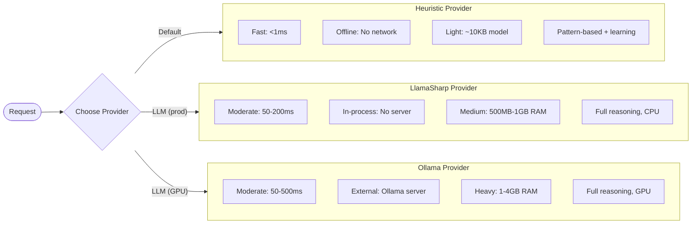
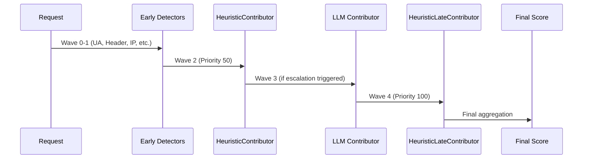
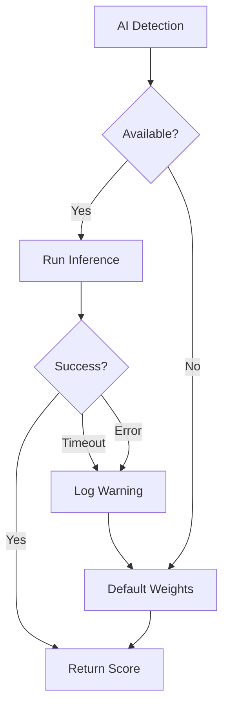

# AI Detection

The AI detection system provides machine learning-based bot classification using a learned heuristic model and optional
LLM inference. This is a **key feature** that enables continuous learning and adaptive detection.

## Architecture Overview



## Quick Start

### Recommended Configuration

```json
{
  "BotDetection": {
    "EnableAiDetection": true,
    "AiDetection": {
      "Provider": "Heuristic",
      "TimeoutMs": 1000,
      "Heuristic": {
        "Enabled": true,
        "LoadLearnedWeights": true,
        "EnableWeightLearning": true
      }
    },
    "Learning": {
      "Enabled": true,
      "LearningRate": 0.1
    }
  }
}
```

### Code Configuration

```csharp
services.AddBotDetection(options =>
{
    options.EnableAiDetection = true;
    options.AiDetection = new AiDetectionOptions
    {
        Provider = AiProvider.Heuristic,
        TimeoutMs = 1000,
        Heuristic = new HeuristicOptions
        {
            Enabled = true,
            LoadLearnedWeights = true,
            EnableWeightLearning = true
        }
    };
});

// Or use the convenience method
services.AddAdvancedBotDetection();
```

---

## Two-Dimensional Scoring

StyloBot uses a two-dimensional scoring model that separates **what** the system believes from **how certain** it is:

| Dimension | Range | Meaning |
|-----------|-------|---------|
| **Bot Probability** | 0.0 - 1.0 | Likelihood that the request is from a bot |
| **Detection Confidence** | 0.0 - 1.0 | How certain the system is in its verdict, regardless of what that verdict is |

Previously, "confidence" was derived from bot probability (distance from 0.5). Now confidence is calculated independently from three factors:

1. **Agreement (40%)** -- what fraction of weighted evidence points in the majority direction
2. **Weight Coverage (35%)** -- total evidence weight compared to an expected baseline
3. **Detector Count (25%)** -- number of distinct detectors that contributed

### How AI Affects Confidence

Running AI detection (heuristic or LLM) increases detection confidence in two ways:

- **Weight coverage** -- AI detectors carry high weights (Heuristic: 2.0, LLM: 2.5), so they significantly increase the total evidence weight relative to baseline, boosting the coverage component.
- **Detector count** -- Each AI detector that runs adds to the distinct detector count, improving the breadth component.

A request evaluated by fast-path detectors alone may have a detection confidence of 0.5-0.7. The same request with AI escalation typically reaches 0.8-0.95 confidence, even if the bot probability stays the same.

### HttpContext Extensions

```csharp
context.GetBotProbability()       // 0.0 - 1.0: likelihood of being a bot
context.GetDetectionConfidence()  // 0.0 - 1.0: certainty of the verdict
context.GetBotConfidence()        // backward compat, returns bot probability
```

---

## Heuristic Detection (Recommended)

The heuristic detector provides fast, learned classification using a lightweight logistic regression model. This is the
**recommended** provider for production.

### How It Works

The heuristic detector operates in two modes depending on when it runs in the pipeline:



### Dynamic Feature Dictionary (KV Store Approach)

The heuristic model uses a **fully dynamic key-value feature dictionary** from `HeuristicFeatureExtractor`.

**Key Innovation:** Features are NOT a fixed-size vector. Instead, they are a dictionary of `name → value` pairs where
feature names are discovered at runtime based on:

- Detector names that contributed
- Category names that were scored
- Signal types that were detected
- User-Agent patterns that matched

This means **new detectors automatically create new features** without any code changes.

#### Feature Naming Convention

Features use prefixes to indicate their source:

| Prefix     | Source                   | Example                                       |
|------------|--------------------------|-----------------------------------------------|
| `req:`     | Request metadata         | `req:ua_length`, `req:is_https`               |
| `hdr:`     | Header presence          | `hdr:accept-language`, `hdr:referer`          |
| `ua:`      | User-Agent patterns      | `ua:contains_bot`, `ua:chrome`                |
| `accept:`  | Accept header patterns   | `accept:wildcard`, `accept:html`              |
| `det:`     | Detector results         | `det:user_agent_detector`, `det:ip_detector`  |
| `det_abs:` | Detector absolute scores | `det_abs:behavioral_detector`                 |
| `cat:`     | Category breakdown       | `cat:suspicious:score`, `cat:verified:count`  |
| `sig:`     | Signal presence          | `sig:known_bot_pattern`, `sig:cloud_ip`       |
| `fail:`    | Failed detectors         | `fail:llm_detector`                           |
| `stat:`    | Aggregated statistics    | `stat:detector_max`, `stat:category_avg`      |
| `result:`  | Final results            | `result:bot_probability`, `result:confidence` |
| `bottype:` | Bot type classification  | `bottype:searchengine`, `bottype:scraper`     |
| `botname:` | Specific bot name        | `botname:googlebot`, `botname:gptbot`         |

#### Example Feature Extraction

For a request from Googlebot, the extracted features might include:

```json
{
  "req:ua_length": 0.45,
  "req:is_https": 1.0,
  "hdr:accept-language": 0.0,
  "hdr:accept": 1.0,
  "ua:contains_bot": 1.0,
  "ua:chrome": 0.0,
  "det:user_agent_detector": 0.95,
  "det:ip_detector": 0.8,
  "cat:searchengine:score": 0.9,
  "stat:detector_max": 0.95,
  "result:bot_probability": 0.92,
  "bottype:searchengine": 1.0,
  "botname:googlebot": 1.0
}
```

### Two Modes of Operation

1. **Early Mode** - When the heuristic detector runs before other detectors:
    - Uses only `req:*`, `hdr:*`, `ua:*`, and `accept:*` features
    - Fast, pattern-based classification from request metadata
    - Good for quick preliminary decisions

2. **Full Mode** - When `AggregatedEvidence` is available:
    - Uses all feature types including `det:*`, `cat:*`, `sig:*`, etc.
    - Leverages results from all detectors in the pipeline
    - Best accuracy through ensemble learning

### Dynamic Weight Learning

Because features are dynamic, weights are also dynamic:

- **Default weights** are provided for common patterns (e.g., `ua:contains_bot` → +0.9)
- **New features** automatically get a default weight of +0.1
- **Learned weights** are stored in SQLite and loaded on startup
- **Weight updates** happen through the learning feedback loop

```csharp
// Weights are stored per feature name, not per index
// Example stored weights:
// "ua:contains_bot" → 0.92
// "det:user_agent_detector" → 0.85
// "hdr:accept-language" → -0.65  (negative = human-like)
```

**Note:** Negative weights indicate human-like signals, positive weights indicate bot-like signals.

### Configuration Options

```json
{
  "BotDetection": {
    "AiDetection": {
      "Provider": "Heuristic",
      "TimeoutMs": 1000,
      "MaxConcurrentRequests": 10,
      "Heuristic": {
        "Enabled": true,
        "LoadLearnedWeights": true,
        "EnableWeightLearning": true,
        "MinConfidenceForLearning": 0.8,
        "LearningRate": 0.01,
        "WeightReloadIntervalMinutes": 60
      }
    }
  }
}
```

| Option                        | Type   | Default | Description                            |
|-------------------------------|--------|---------|----------------------------------------|
| `Enabled`                     | bool   | `true`  | Enable heuristic detection             |
| `LoadLearnedWeights`          | bool   | `true`  | Load weights from database on startup  |
| `EnableWeightLearning`        | bool   | `true`  | Update weights from detection feedback |
| `MinConfidenceForLearning`    | double | `0.8`   | Minimum confidence for weight updates  |
| `LearningRate`                | double | `0.01`  | Learning rate for weight adjustments   |
| `WeightReloadIntervalMinutes` | int    | `60`    | How often to reload weights from store |

### Continuous Learning

The heuristic model improves over time through the learning feedback loop:



**How Learning Works:**

1. Each detection produces a feature vector and confidence score
2. High-confidence detections update weights in the `WeightStore`
3. Weights are persisted to SQLite for survival across restarts
4. Periodic weight reloads ensure the model stays current

### Weight Persistence

Weights are stored in the SQLite database and persist across application restarts:

```csharp
// Weights are automatically loaded from store
// and updated based on detection feedback

// Manual weight reload
var detector = app.Services.GetRequiredService<HeuristicDetector>();
await detector.ReloadWeightsAsync();
```

### Feature Names API

For debugging and introspection:

```csharp
// Get feature names
var names = HeuristicDetector.GetFeatureNames();
// ["ua_length_norm", "has_accept_language", ...]

// Get current weights
var weights = detector.GetCurrentWeights();
// [0.5f, -0.8f, ...]

// Get current bias
var bias = detector.GetCurrentBias();
// 0.2f
```

---

## LLM Plugin Architecture (v4.0)

In v4.0, LLM detection was refactored from a monolithic detector into a **plugin architecture** with swappable providers and three distinct use cases.

### Architecture

The LLM subsystem is split across three NuGet packages:

| Package | Purpose |
|---------|---------|
| `Mostlylucid.BotDetection.Llm` | Common abstractions: `ILlmProvider`, prompt builders, response parser |
| `Mostlylucid.BotDetection.Llm.LlamaSharp` | In-process CPU provider (default for production) |
| `Mostlylucid.BotDetection.Llm.Ollama` | External HTTP provider (GPU capable via Ollama server) |

All providers implement the `ILlmProvider` interface:

```csharp
public interface ILlmProvider
{
    Task<string> CompleteAsync(LlmRequest request, CancellationToken ct = default);
    bool IsReady { get; }
    Task InitializeAsync(CancellationToken ct = default);
}
```

Only one provider is active per application. Shared services (classification, bot naming, score narratives) are registered automatically by the provider's extension method.

### Three LLM Use Cases

1. **Background Classification** -- The `LlmClassificationCoordinator` sends ambiguous signatures to the LLM for bot/human classification. This runs asynchronously in the background and **never blocks** the request pipeline. Results feed back into the signature's score on subsequent requests.

2. **Bot Naming** -- When a new bot cluster is identified, the `LlmBotNameSynthesizer` generates a creative name and description from the cluster's detection signals. A ring buffer of recently used names prevents duplicates.

3. **Score Change Narratives** -- The `LlmScoreNarrativeService` generates plain English explanations when a signature's bot probability changes significantly (e.g., "This signature jumped from 0.3 to 0.8 because three new datacenter IP signals appeared").

### Registration

```csharp
// Option A: In-process CPU (default, zero external deps)
builder.Services.AddBotDetection();
builder.Services.AddStylobotLlamaSharp();

// Option B: External Ollama (GPU capable)
builder.Services.AddBotDetection();
builder.Services.AddStylobotOllama("http://localhost:11434", "qwen3:0.6b");

// Option C: No LLM (graceful degradation)
builder.Services.AddBotDetection();
// Classification, naming, and narratives silently degrade to defaults
```

### LlamaSharp Provider (Recommended for Production)

Runs inference in-process using LlamaSharp with GGUF models. Zero external dependencies -- the model is downloaded automatically on first use from Hugging Face.

**Configuration** (`BotDetection:AiDetection:LlamaSharp`):

```json
{
  "BotDetection": {
    "AiDetection": {
      "LlamaSharp": {
        "ModelPath": "Qwen/Qwen2.5-0.5B-Instruct-GGUF/qwen2.5-0.5b-instruct-q4_k_m.gguf",
        "ContextSize": 512,
        "TimeoutMs": 10000,
        "ModelCacheDir": null,
        "ThreadCount": 0,
        "Temperature": 0.1,
        "MaxTokens": 150
      }
    }
  }
}
```

| Option | Type | Default | Description |
|--------|------|---------|-------------|
| `ModelPath` | string | `Qwen/Qwen2.5-0.5B-Instruct-GGUF/...` | GGUF file path or Hugging Face model ID (auto-downloads) |
| `ContextSize` | int | `512` | Maximum context size in tokens |
| `TimeoutMs` | int | `10000` | Inference timeout in milliseconds |
| `ModelCacheDir` | string | `~/.cache/stylobot-models` | Cache directory for downloaded models (or `STYLOBOT_MODEL_CACHE` env var) |
| `ThreadCount` | int | all cores | CPU threads for inference |
| `Temperature` | float | `0.1` | Generation randomness (0.0-1.0) |
| `MaxTokens` | int | `150` | Maximum tokens to generate |

### Ollama Provider (GPU Capable)

Sends inference requests over HTTP to an external Ollama server. Best when GPU acceleration is available or when you want to share a model server across multiple instances.

**Setup:**

1. Install Ollama: https://ollama.ai/download
2. Pull a model: `ollama pull qwen3:0.6b`
3. Register the provider:

```csharp
builder.Services.AddStylobotOllama("http://localhost:11434", "qwen3:0.6b");
```

**Configuration** (`BotDetection:AiDetection:Ollama`):

```json
{
  "BotDetection": {
    "AiDetection": {
      "Ollama": {
        "Endpoint": "http://localhost:11434",
        "Model": "qwen3:0.6b",
        "NumThreads": 4
      }
    }
  }
}
```

| Option | Type | Default | Description |
|--------|------|---------|-------------|
| `Endpoint` | string | `http://localhost:11434` | Ollama API endpoint |
| `Model` | string | `qwen3:0.6b` | Model name |
| `NumThreads` | int | `4` | CPU threads for Ollama inference |

### Background-Only Execution

All LLM work runs in the background via `LlmClassificationCoordinator`. The request pipeline is never blocked by LLM inference. When no `ILlmProvider` is registered (Option C above), all three use cases degrade gracefully:

- Classification falls back to heuristic scoring only
- Bot naming uses the default rule-based name generator
- Score narratives return `null` (the dashboard omits the narrative field)

---

## Provider Comparison



| Feature          | Heuristic                       | LlamaSharp               | Ollama                |
|------------------|---------------------------------|--------------------------|-----------------------|
| **Latency**      | <1ms                            | 50-200ms                 | 50-500ms              |
| **Accuracy**     | Good (pattern-based + learning) | Best (full reasoning)    | Best (full reasoning) |
| **Resources**    | ~10KB memory                    | 500MB-1GB RAM            | 1-4GB RAM             |
| **Dependencies** | None (in-process)               | None (in-process)        | Ollama server         |
| **GPU Support**  | N/A                             | No (CPU only)            | Yes                   |
| **Offline**      | Yes                             | Yes                      | Yes (local)           |
| **Learning**     | Continuous                      | Static                   | Static                |
| **Use Cases**    | Inline detection                | Classification, naming, narratives | Classification, naming, narratives |

### Recommendation

1. **Start with Heuristic only** -- Fast, low overhead, continuously learns
2. **Add LlamaSharp for LLM features** -- Zero external deps, good for production
3. **Use Ollama when GPU is available** -- Faster inference on GPU hardware
4. **Enable learning** -- Continuous improvement of heuristic weights

```json
{
  "BotDetection": {
    "EnableAiDetection": true,
    "AiDetection": {
      "Provider": "Heuristic",
      "Heuristic": {
        "Enabled": true,
        "EnableWeightLearning": true
      }
    },
    "Policies": {
      "strict": {
        "EscalateToAi": true,
        "AiEscalationThreshold": 0.6
      }
    }
  }
}
```

---

## HeuristicLate Contributor (Post-AI Refinement)

The `HeuristicLateContributor` runs **after** the AI/LLM detectors to provide a final classification layer that
incorporates all prior evidence, including AI results.

### Detection Pipeline Flow



### How It Works

The late heuristic contributor:

1. **Waits for AI signals** - Triggers when `AiPrediction` or `AiConfidence` signals exist
2. **Builds complete evidence** - Aggregates all contributions including AI results
3. **Runs in "full mode"** - Uses the complete 64-feature vector
4. **Provides final refinement** - Weighted at 2.5 (higher than early heuristic at 2.0)

### Trigger Conditions

```csharp
public override IReadOnlyList<TriggerCondition> TriggerConditions =>
[
    // Option 1: AI prediction is available - run after AI
    Triggers.AnyOf(
        Triggers.WhenSignalExists(SignalKeys.AiPrediction),
        Triggers.WhenSignalExists(SignalKeys.AiConfidence)),
    // Option 2: Enough static detectors have run (fallback when no AI)
    Triggers.WhenDetectorCount(5)
];
```

### Configuration

The late heuristic is automatically included in policies that use the AI path:

```json
{
  "BotDetection": {
    "Policies": {
      "default": {
        "FastPath": ["FastPathReputation", "UserAgent", "Header", "Ip",
                     "SecurityTool", "ProjectHoneypot", "Behavioral",
                     "ClientSide", "Inconsistency", "VersionAge",
                     "ReputationBias", "Heuristic"],
        "AiPath": ["Llm", "HeuristicLate"],
        "EscalateToAi": true
      }
    }
  }
}
```

### When It Runs

| Scenario               | HeuristicLate Behavior                      |
|------------------------|---------------------------------------------|
| AI ran and completed   | Runs with AI signals in feature vector      |
| AI escalation disabled | Runs after 5+ detectors complete (fallback) |
| All detectors skipped  | Does not run (no trigger satisfied)         |

### Signals Emitted

| Signal Key             | Type   | Description      |
|------------------------|--------|------------------|
| `heuristic.prediction` | string | "bot" or "human" |
| `heuristic.confidence` | double | 0.0 to 1.0       |

### Reason Label

The late heuristic labels its reason with "(late)" to distinguish from early heuristic:

```
Early: "Heuristic prediction: bot (p=0.85, conf=0.92) (early)"
Late:  "Heuristic prediction: bot (p=0.88, conf=0.95) (late)"
```

---

## Fail-Safe Behavior

AI detection is designed to fail gracefully:



**Guarantees:**

- AI detection **never blocks** the pipeline
- Timeouts are logged, not thrown
- Default weights always available
- Circuit breaker prevents cascade failures

---

## Monitoring

### Metrics

```csharp
// OpenTelemetry metrics
bot_detection_ai_inference_duration_seconds
bot_detection_ai_inference_total
bot_detection_ai_inference_errors_total
bot_detection_heuristic_weights_loaded
bot_detection_heuristic_learning_updates_total
```

### Health Check

```csharp
app.MapHealthChecks("/health/ai", new HealthCheckOptions
{
    Predicate = check => check.Tags.Contains("ai")
});
```

### Diagnostic Endpoint

```bash
GET /bot-detection/ai-status

{
  "provider": "Heuristic",
  "weightsLoaded": true,
  "weightCount": 47,
  "featuresSample": [
    "ua:contains_bot",
    "hdr:accept-language",
    "det:user_agent_detector",
    "stat:detector_max"
  ],
  "bias": 0.1,
  "learningEnabled": true,
  "inferenceCount": 12345,
  "averageLatencyMs": 0.3
}
```

---

## Troubleshooting

### Weights Not Loading

```
Warning: Failed to load weights from store, using defaults
```

**Solutions:**

1. Check database connection
2. Verify `WeightStore` is registered
3. Check `LoadLearnedWeights` is true
4. Ensure database file exists and is writable

### LLM Provider Not Ready

```
Debug: LLM provider not ready, skipping classification
```

**LlamaSharp solutions:**

1. Check that the GGUF model path or Hugging Face ID in `BotDetection:AiDetection:LlamaSharp:ModelPath` is correct
2. Verify the model cache directory is writable (default: `~/.cache/stylobot-models`)
3. On first run, model download may take a few minutes -- check logs for download progress
4. Ensure sufficient RAM for the model (500MB-1GB for 0.5B models)

**Ollama solutions:**

1. Start Ollama: `ollama serve`
2. Check endpoint URL in `BotDetection:AiDetection:Ollama:Endpoint`
3. Verify firewall settings
4. Pull required model: `ollama pull qwen3:0.6b`

### Learning Not Updating

```
Debug: No weight store available, skipping weight update
```

**Solutions:**

1. Ensure `IWeightStore` is registered
2. Check `EnableWeightLearning` is true
3. Verify `MinConfidenceForLearning` threshold
4. Check database write permissions
