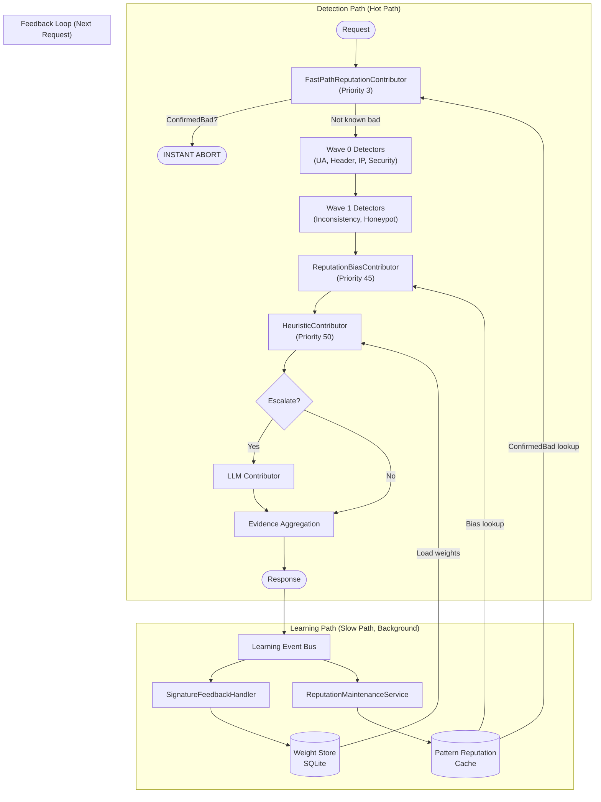
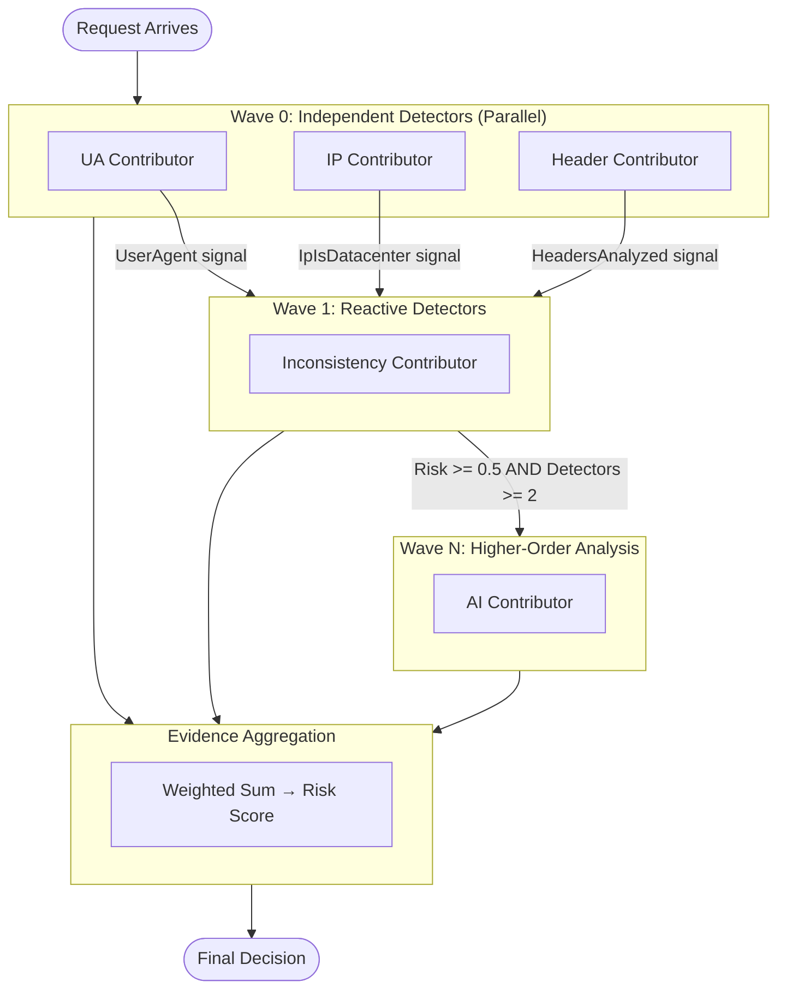
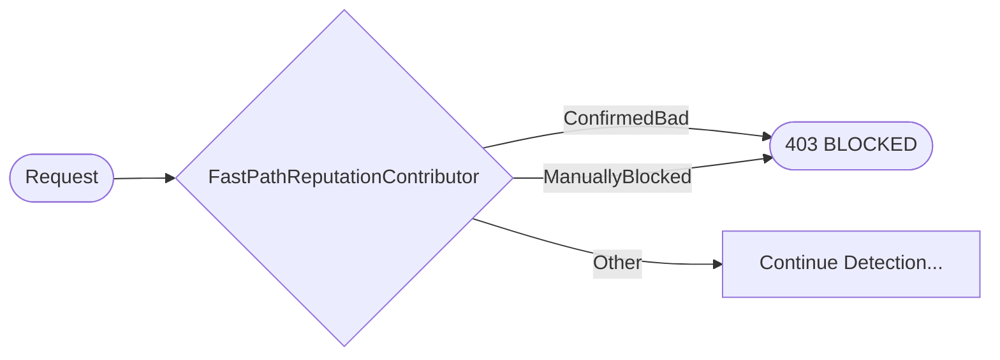
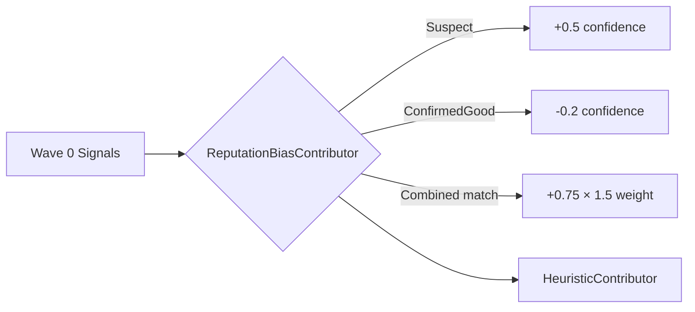
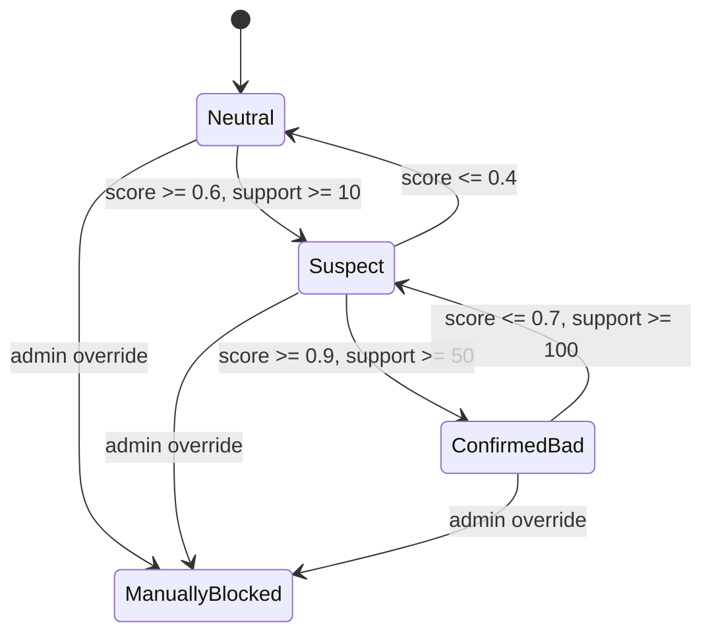
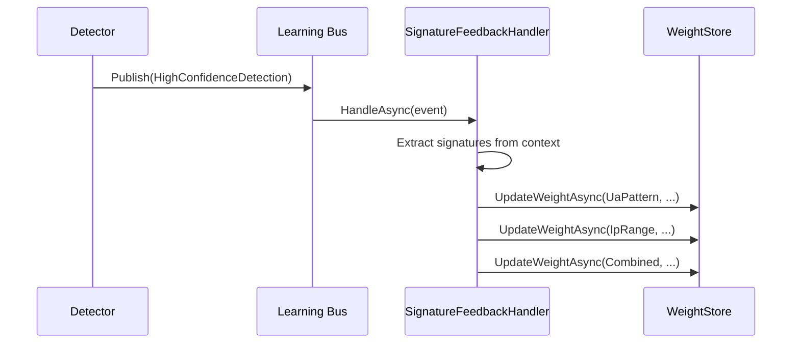

# Learning and Reputation System

The learning and reputation system enables the bot detector to adapt over time, learning new patterns while gracefully
forgetting stale ones. This prevents the system from becoming overly paranoid as infrastructure changes.

## Overview

The system operates on **four levels**:

1. **Fast-Path Reputation (Instant Abort)** - Known bad patterns trigger instant blocking before any analysis
2. **Intra-Request (Blackboard Architecture)** - Detectors share signals within a single request, enabling reactive and
   coordinated detection
3. **Inter-Request (Reputation System)** - Patterns are tracked across requests with online learning and time decay
4. **Feedback Loop (Weight Store)** - Detector weights are continuously adjusted based on detection outcomes

### Complete Learning Flow



**See also:**

- [AI Detection](ai-detection.md) - Heuristic model and LLM detection
- [Detection Strategies](detection-strategies.md) - Wave-based detection flow
- [Configuration](configuration.md) - Full configuration reference

## Blackboard Architecture

**New in 0.5.0-preview1**

The blackboard architecture enables event-driven, parallel detection where detectors:

- Run concurrently when independent
- Emit evidence (contributions), not verdicts
- Trigger other detectors based on signals
- Allow the orchestrator to aggregate into a final decision

### Core Concepts



### Detection Contribution

Detectors emit `DetectionContribution` objects instead of verdicts:

```csharp
public sealed record DetectionContribution
{
    public required string DetectorName { get; init; }
    public required string Category { get; init; }
    public required double ConfidenceDelta { get; init; }  // -1.0 to +1.0
    public double Weight { get; init; } = 1.0;
    public required string Reason { get; init; }
    public ImmutableDictionary<string, object> Signals { get; init; }
    public bool TriggerEarlyExit { get; init; }
}
```

Key properties:

- **ConfidenceDelta**: Positive = more likely bot, negative = more likely human
- **Weight**: Influence on final score (default 1.0)
- **Signals**: Data emitted for other detectors to consume

### Trigger Conditions

Detectors can specify conditions for when they should run:

```csharp
public class MyContributor : ContributingDetectorBase
{
    public override IReadOnlyList<TriggerCondition> TriggerConditions =>
    [
        Triggers.AllOf(
            Triggers.WhenSignalExists(SignalKeys.UserAgent),
            Triggers.WhenRiskExceeds(0.5)
        )
    ];
}
```

Available triggers:

- `WhenSignalExists(key)` - Signal present in blackboard
- `WhenSignalEquals(key, value)` - Signal has specific value
- `WhenRiskExceeds(threshold)` - Current risk above threshold
- `WhenDetectorCount(min)` - Minimum detectors completed
- `AllOf(...)` - All conditions must be met
- `AnyOf(...)` - Any condition met

### Early Exit

High-confidence detections can trigger early exit:

```csharp
// Verified good bot (e.g., Googlebot with valid DNS)
return DetectionContribution.VerifiedGoodBot(
    Name, "Googlebot", "DNS verification passed");

// Verified bad bot (e.g., known malicious signature)
return DetectionContribution.VerifiedBadBot(
    Name, "BadBot/1.0", "Known malicious signature");
```

Early exit skips remaining detectors and returns immediately.

## Reputation Feedback Contributors

**New in 1.0.1**

The reputation feedback loop is closed by two specialized contributors that query the `IPatternReputationCache` to apply
learned patterns during detection.

### FastPathReputationContributor (Instant Abort)

The `FastPathReputationContributor` runs **first** (Priority 3, Wave 0, no dependencies) to enable instant abort for
known bad actors before any expensive analysis.



**Key characteristics:**

- **Priority 3** - Runs before all other detectors
- **No trigger conditions** - Runs immediately in Wave 0
- **Only checks abort-eligible patterns** - `ConfirmedBad` and `ManuallyBlocked`
- **Skips Neutral/Suspect** - Those are handled by ReputationBiasContributor later
- **Uses raw UA/IP** - No signal extraction needed

**Pattern matching ("12 basic shapes"):**

The fast path normalizes User-Agent to key indicators for instant lookup:

```
Chrome + Windows + len:normal → ua:a1b2c3d4e5f6g7h8
Firefox + Linux + bot → ua:x9y8z7w6v5u4t3s2
Python + curl + len:short → ua:m1n2o3p4q5r6s7t8
```

This normalization creates a finite set of "shapes" that can be instantly matched against known bad patterns.

**Code example:**

```csharp
// FastPathReputationContributor (simplified)
public override Task<IReadOnlyList<DetectionContribution>> ContributeAsync(
    BlackboardState state, CancellationToken ct)
{
    // Check raw UA against known bad patterns
    if (!string.IsNullOrWhiteSpace(state.UserAgent))
    {
        var uaPatternId = CreateUaPatternId(state.UserAgent);
        var reputation = _reputationCache.Get(uaPatternId);

        if (reputation?.CanTriggerFastAbort == true)
        {
            return Task.FromResult(new[]
            {
                DetectionContribution.VerifiedBadBot(
                    Name, reputation.PatternId,
                    $"Known bad pattern: {reputation.State}",
                    BotType.MaliciousBot) with
                {
                    Weight = 3.0 // Very high weight for instant abort
                }
            });
        }
    }

    // No fast-path hit - continue with normal detection
    return Task.FromResult(Array.Empty<DetectionContribution>());
}
```

### ReputationBiasContributor (Scoring Bias)

The `ReputationBiasContributor` runs **after** Wave 0 signal extraction but **before** the Heuristic model to provide
learned bias.



**Key characteristics:**

- **Priority 45** - Runs after Wave 0, before Heuristic (50)
- **Triggers on `SignalKeys.UserAgent`** - Waits for signal extraction
- **Checks all reputation states** - Not just abort-eligible
- **Provides weighted bias** - Influences final scoring

**Pattern types checked:**

1. **User-Agent hash** - Normalized UA indicators
2. **IP range** - CIDR /24 for IPv4, /48 for IPv6
3. **Combined signature** - UA + IP + Path hash (highest weight)

**Bias weights by state:**

| State             | FastPathWeight   | Weight Multiplier | Effect            |
|-------------------|------------------|-------------------|-------------------|
| `Neutral`         | `BotScore × 0.1` | 0.1               | Minimal           |
| `Suspect`         | `BotScore × 0.5` | 0.5               | Moderate          |
| `ConfirmedBad`    | `BotScore × 1.0` | 1.0               | Full              |
| `ConfirmedGood`   | `-0.2`           | 0.2               | Reduces suspicion |
| `ManuallyBlocked` | `1.0`            | 2.5               | Always max        |
| `ManuallyAllowed` | `-1.0`           | 2.5               | Always trusted    |

**Code example:**

```csharp
// ReputationBiasContributor (simplified)
public override IReadOnlyList<TriggerCondition> TriggerConditions =>
[
    Triggers.WhenSignalExists(SignalKeys.UserAgent)
];

public override Task<IReadOnlyList<DetectionContribution>> ContributeAsync(
    BlackboardState state, CancellationToken ct)
{
    var contributions = new List<DetectionContribution>();

    // Check UA reputation
    var uaReputation = _cache.Get(CreateUaPatternId(state.UserAgent));
    if (uaReputation?.State != ReputationState.Neutral)
    {
        contributions.Add(CreateBiasContribution(uaReputation, "UserAgent"));
    }

    // Check IP reputation
    var ipReputation = _cache.Get(CreateIpPatternId(state.ClientIp));
    if (ipReputation?.State != ReputationState.Neutral)
    {
        contributions.Add(CreateBiasContribution(ipReputation, "IP"));
    }

    // Check combined signature (highest weight)
    var combinedReputation = _cache.Get(CreateCombinedPatternId(
        state.UserAgent, state.ClientIp, state.Path));
    if (combinedReputation?.State != ReputationState.Neutral)
    {
        var contribution = CreateBiasContribution(combinedReputation, "Combined");
        contributions.Add(contribution with { Weight = contribution.Weight * 1.5 });
    }

    return Task.FromResult<IReadOnlyList<DetectionContribution>>(contributions);
}
```

### Signal Keys for Reputation

| Signal Key                | Type | Description                                          |
|---------------------------|------|------------------------------------------------------|
| `reputation.bias_applied` | bool | True if any reputation bias was applied              |
| `reputation.bias_count`   | int  | Number of reputation patterns matched                |
| `reputation.can_abort`    | bool | True if any pattern can trigger fast abort           |
| `reputation.fastpath_hit` | bool | True if fast-path found ConfirmedBad/ManuallyBlocked |

### Complete Detection Flow with Reputation

```
Request arrives
    │
    ▼
┌─────────────────────────────────────────────────────────────┐
│  FastPathReputationContributor (Priority 3)                 │
│  - Check raw UA hash → IPatternReputationCache              │
│  - Check raw IP range → IPatternReputationCache             │
│  - If ConfirmedBad/ManuallyBlocked → INSTANT ABORT (403)    │
└─────────────────────────────────────────────────────────────┘
    │ (no match)
    ▼
┌─────────────────────────────────────────────────────────────┐
│  Wave 0: UA, Header, IP, Behavioral, ClientSide, Security  │
│  - Extract signals: UserAgent, ClientIp, Headers, etc.     │
│  - SecurityToolContributor checks penetration tools        │
└─────────────────────────────────────────────────────────────┘
    │
    ▼
┌─────────────────────────────────────────────────────────────┐
│  Wave 1: VersionAge, Inconsistency, ProjectHoneypot        │
│  - Triggered by Wave 0 signals                             │
│  - DNS-based IP reputation (Honeypot)                      │
└─────────────────────────────────────────────────────────────┘
    │
    ▼
┌─────────────────────────────────────────────────────────────┐
│  ReputationBiasContributor (Priority 45)                    │
│  - Uses extracted signals for pattern ID creation          │
│  - Checks UA, IP, Combined patterns                        │
│  - Adds bias contributions for Suspect/ConfirmedGood       │
└─────────────────────────────────────────────────────────────┘
    │
    ▼
┌─────────────────────────────────────────────────────────────┐
│  HeuristicContributor (Priority 50)                         │
│  - Logistic regression with learned weights                │
│  - Bias contributions influence final score                │
└─────────────────────────────────────────────────────────────┘
    │
    ▼
┌─────────────────────────────────────────────────────────────┐
│  LLM Contributor (if escalation triggered)                  │
│  - Full AI analysis for edge cases                         │
└─────────────────────────────────────────────────────────────┘
    │
    ▼
┌─────────────────────────────────────────────────────────────┐
│  HeuristicLateContributor (Final scoring)                   │
│  - Consumes all evidence                                   │
│  - Final risk score calculation                            │
└─────────────────────────────────────────────────────────────┘
    │
    ▼
Response + Learning Event → Background Update Loop
```

### Evidence Aggregation

The `EvidenceAggregator` combines contributions:

```
finalScore = Σ(contribution.ConfidenceDelta × contribution.Weight) / Σ(weights)
```

Then normalized to [0, 1] range and mapped to risk bands.

## Pattern Reputation System

Patterns (UA strings, IP ranges, fingerprints) have reputation scores that evolve over time.

### Reputation Properties

| Property   | Description                               |
|------------|-------------------------------------------|
| `BotScore` | 0.0 (human) to 1.0 (bot) - current belief |
| `Support`  | Effective sample count (decays over time) |
| `State`    | Neutral → Suspect → ConfirmedBad          |
| `LastSeen` | For time decay when pattern goes quiet    |

### State Machine



**Note**: Hysteresis ensures it's harder to forgive (100 samples) than accuse (50 samples). Manual overrides never
auto-downgrade.

### Online Updates

Each detection updates the pattern's reputation via Exponential Moving Average (EMA):

```
BotScore_new = (1 - α) × BotScore_old + α × label
```

Where:

- `α` = learning rate (default 0.1)
- `label` = 1.0 for bot, 0.0 for human

### Time Decay (Forgetting)

Stale patterns drift back toward neutral:

```
BotScore_new = BotScore_old + (prior - BotScore_old) × (1 - e^(-Δt/τ))
Support_new = Support_old × e^(-Δt/τ_support)
```

Where:

- `prior` = 0.5 (neutral)
- `τ` = 7 days (score decay time constant)
- `τ_support` = 14 days (support decay time constant)

This ensures:

- Inactive patterns gradually lose influence
- Once-bad patterns can be rehabilitated
- System doesn't accumulate stale data

### Garbage Collection

Patterns are eligible for removal when:

- `LastSeen` > 90 days ago
- `Support` < 1.0
- `State` = Neutral

### Configuration

```json
{
  "BotDetection": {
    "Reputation": {
      "LearningRate": 0.1,
      "MaxSupport": 1000,
      "ScoreDecayTauHours": 168,
      "SupportDecayTauHours": 336,
      "Prior": 0.5,
      "PromoteToBadScore": 0.9,
      "PromoteToBadSupport": 50,
      "DemoteFromBadScore": 0.7,
      "DemoteFromBadSupport": 100,
      "GcEligibleDays": 90
    }
  }
}
```

## Learning Event Bus

The inter-request learning bus handles async pattern learning:

### Event Types

| Event                     | Description                       | Handler                  |
|---------------------------|-----------------------------------|--------------------------|
| `HighConfidenceDetection` | Bot detected with >0.9 confidence | Training data collection |
| `PatternDiscovered`       | AI found new pattern              | Pattern store update     |
| `InconsistencyDetected`   | Cross-signal mismatch             | Reputation adjustment    |
| `UserFeedback`            | Admin confirmed/denied            | Strong reputation update |
| `InferenceRequest`        | Request async AI analysis         | Heuristic/LLM inference  |
| `DriftDetected`           | Pattern behavior changed          | Alert/relearn            |

### Publishing Events

```csharp
_learningBus.Publish(new LearningEvent
{
    Type = LearningEventType.HighConfidenceDetection,
    Confidence = 0.95,
    Features = extractedFeatures,
    Label = true, // bot
    Metadata = new Dictionary<string, object>
    {
        ["userAgent"] = userAgent,
        ["ipAddress"] = clientIp
    }
});
```

### Handling Events

```csharp
public class MyLearningHandler : ILearningEventHandler
{
    public IReadOnlySet<LearningEventType> HandledEventTypes => new HashSet<LearningEventType>
    {
        LearningEventType.HighConfidenceDetection
    };

    public async Task HandleAsync(LearningEvent evt, CancellationToken ct)
    {
        if (evt.Confidence >= 0.9 && evt.Features != null)
        {
            await StoreTrainingDataAsync(evt.Features, evt.Label ?? true, ct);
        }
    }
}
```

## Drift Detection

**New in 0.5.0-preview1**

The system monitors for concept drift - when pattern behavior changes:

### Types of Drift

1. **Feature Drift** - Input distribution changes
2. **Label Drift** - Bot/human ratio changes
3. **Concept Drift** - Relationship between features and labels changes

### Detection Method

```csharp
// Windowed statistics comparison
var recentBotRate = windowedStats.RecentBotRate;
var historicalBotRate = windowedStats.HistoricalBotRate;

if (Math.Abs(recentBotRate - historicalBotRate) > DriftThreshold)
{
    PublishDriftAlert(patternType, recentBotRate, historicalBotRate);
}
```

### Configuration

```json
{
  "BotDetection": {
    "Drift": {
      "Enabled": true,
      "WindowSizeMinutes": 60,
      "ThresholdPercent": 20,
      "MinSamplesForDetection": 100
    }
  }
}
```

## Safety Rails

1. **Manual overrides never auto-downgrade** - Admin blocks require admin unblock
2. **Asymmetric thresholds** - Harder to forgive (100 samples) than accuse (50 samples)
3. **Time decay prevents permanent bans** - All patterns eventually drift to neutral
4. **GC only touches neutral patterns** - Active/blocked patterns are preserved
5. **Circuit breakers per detector** - Failed detectors don't block the pipeline

## Best Practices

### Do

- Enable learning in production for continuous improvement
- Review drift alerts promptly
- Use manual blocks for known-bad actors
- Monitor reputation state distributions

### Don't

- Set learning rate too high (oscillations)
- Set decay time too short (forgetting too fast)
- Ignore drift alerts (may indicate attack or bug)
- Manually block without investigation

## Accessing Reputation Data

```csharp
// Get reputation for a pattern
var reputation = await _reputationStore.GetAsync(patternType, patternValue);

// Check state
if (reputation.State == ReputationState.ConfirmedBad)
{
    // Block or challenge
}

// Get all suspects (for admin review)
var suspects = await _reputationStore.GetByStateAsync(ReputationState.Suspect);
```

## Weight Store (Feedback Loop)

The Weight Store provides persistent storage for learned detector weights, enabling the system to improve detection
accuracy over time based on outcomes.

### Architecture

```
Detection → Signature Extraction → Weight Lookup → Enhanced Score
     ↓                                                    ↓
Learning Event ← ─ ─ ─ ─ ─ ─ ─ ─ ─ ─ ─ ─ ─ ─ ─ ─ ─ ← Outcome
     ↓
Weight Update (EMA)
     ↓
SQLite Store
```

### Signature Types

The system tracks weights for multiple signature types:

| Type           | Description            | Example                             |
|----------------|------------------------|-------------------------------------|
| `UaPattern`    | User-Agent substrings  | `HeadlessChrome`, `python-requests` |
| `IpRange`      | IP CIDR ranges         | `34.64.0.0/10` (Google Cloud)       |
| `PathPattern`  | Request path patterns  | `/api/login`, `/wp-admin/*`         |
| `BehaviorHash` | Behavioral fingerprint | Rate + timing + path entropy        |
| `Combined`     | Multi-signal signature | UA + IP + behavior combined         |

### How Weights Are Updated

Weights use Exponential Moving Average (EMA) for smooth updates:

```
weight_new = (1 - α) × weight_old + α × outcome
```

Where:

- `α` = learning rate (default 0.1)
- `outcome` = 1.0 for confirmed bot, 0.0 for confirmed human

### Decay for Stale Patterns

Patterns that haven't been seen gradually decay toward neutral:

```
weight_decayed = weight + (0.5 - weight) × (1 - e^(-Δt/τ))
```

This prevents old patterns from having outsized influence.

### Configuration

```json
{
  "BotDetection": {
    "Learning": {
      "Enabled": true,
      "WeightStore": {
        "DatabasePath": "data/weights.db",
        "LearningRate": 0.1,
        "DecayTauHours": 168,
        "MinSampleCount": 5,
        "MaxWeight": 2.0,
        "MinWeight": 0.1
      }
    }
  }
}
```

| Option           | Type   | Default           | Description                              |
|------------------|--------|-------------------|------------------------------------------|
| `DatabasePath`   | string | `data/weights.db` | SQLite database path                     |
| `LearningRate`   | double | `0.1`             | EMA alpha for weight updates             |
| `DecayTauHours`  | int    | `168`             | Time constant for weight decay (7 days)  |
| `MinSampleCount` | int    | `5`               | Minimum samples before weight is applied |
| `MaxWeight`      | double | `2.0`             | Maximum weight multiplier                |
| `MinWeight`      | double | `0.1`             | Minimum weight multiplier                |

### Weight Store API

```csharp
// Get current weight for a signature
var weight = await _weightStore.GetWeightAsync(SignatureType.UaPattern, "HeadlessChrome");

// Update weight after detection outcome
await _weightStore.UpdateWeightAsync(
    SignatureType.UaPattern,
    "HeadlessChrome",
    wasBot: true,
    confidence: 0.95);

// Get statistics
var stats = await _weightStore.GetStatsAsync();
// Returns: TotalWeights, UaPatternWeights, IpRangeWeights, etc.

// Cleanup old entries
await _weightStore.DecayOldWeightsAsync(maxAgeDays: 90);
```

## Signature Feedback Handler

The `SignatureFeedbackHandler` listens to learning events and automatically updates weights:

### How It Works



### Event Types Handled

| Event                     | Action                                      |
|---------------------------|---------------------------------------------|
| `HighConfidenceDetection` | Update weights for all extracted signatures |
| `UserFeedback`            | Strong weight update (confirmed by admin)   |
| `PatternDiscovered`       | Add new signature with initial weight       |

### Signature Extraction

The handler extracts multiple signatures from each detection:

```csharp
// From a single detection, extracts:
// - UA pattern: "HeadlessChrome" (from User-Agent)
// - IP range: "34.64.0.0/10" (datacenter range)
// - Path pattern: "/api/login" (normalized)
// - Behavior hash: "rate:high|timing:low|entropy:med"
// - Combined: hash of all above
```

### Enabling the Feedback Loop

The feedback handler is automatically registered when learning is enabled:

```csharp
services.AddBotDetection(options =>
{
    options.Learning.Enabled = true;
});
```

Or via configuration:

```json
{
  "BotDetection": {
    "Learning": {
      "Enabled": true
    }
  }
}
```

## Integration with Heuristic Feature Extraction

The Weight Store integrates with the Heuristic detector to provide learned weights as input features:

```
Request → Detectors → Evidence → Feature Extractor
                                       ↓
                              Weight Store Lookup
                                       ↓
                              Feature vector with learned weights
                                       ↓
                               Heuristic Model
```

The feature extractor pulls top contribution weights (sorted by impact) into the feature vector, allowing the Heuristic
model to incorporate learned patterns.

## Monitoring the Learning System

### Diagnostic Endpoints

```bash
# Weight store statistics
GET /bot-detection/learning/stats

{
  "totalWeights": 1234,
  "uaPatternWeights": 456,
  "ipRangeWeights": 234,
  "pathPatternWeights": 321,
  "behaviorHashWeights": 123,
  "combinedWeights": 100,
  "averageWeight": 1.15,
  "oldestEntryDays": 45
}

# Recent learning events
GET /bot-detection/learning/events?limit=100
```

### Metrics

```csharp
// OpenTelemetry metrics
bot_detection_learning_events_total
bot_detection_weight_updates_total
bot_detection_weight_store_size
bot_detection_signature_extractions_total
```

## Best Practices

### Do

- Enable learning in production for continuous improvement
- Monitor weight distribution for anomalies
- Set appropriate decay times for your traffic patterns
- Use admin feedback for high-confidence corrections

### Don't

- Set learning rate too high (causes oscillation)
- Set decay time too short (forgets too quickly)
- Ignore weight drift alerts
- Skip the minimum sample count requirement
