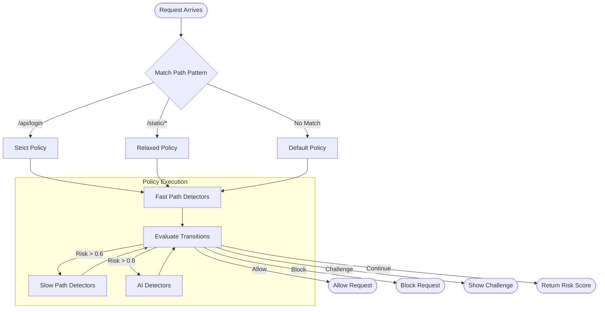

# Detection Policies

**New in 0.5.0-preview1**

Detection policies allow you to configure different detection workflows for different URL paths or scenarios. This
enables fine-grained control over which detectors run, their weights, and how risk thresholds trigger actions.

## Overview

A policy defines:

- **Which detectors run** (fast path, slow path, AI path)
- **Detection weights** (per-policy overrides)
- **Thresholds** (early exit, immediate block, AI escalation)
- **Transitions** (move between policies or take actions based on signals)

## Built-in Policies

Four policies are registered by default:

| Policy              | Description                    | Use Case                    |
|---------------------|--------------------------------|-----------------------------|
| `default`           | Balanced detection             | General-purpose endpoints   |
| `strict`            | Deep analysis, AI escalation   | Login, payment, admin       |
| `relaxed`           | Fast, minimal detection        | Static content, public APIs |
| `allowVerifiedBots` | Allows verified search engines | SEO-friendly endpoints      |

## Configuration

### appsettings.json

```json
{
  "BotDetection": {
    "DefaultPolicyName": "default",

    "PathPolicies": {
      "/api/login": "strict",
      "/api/payment/*": "strict",
      "/api/admin/**": "strict",
      "/static/*": "relaxed",
      "/sitemap.xml": "allowVerifiedBots",
      "/robots.txt": "allowVerifiedBots"
    },

    "Policies": {
      "customApi": {
        "Description": "Custom API policy",
        "FastPath": ["UserAgent", "Header"],
        "SlowPath": ["Behavioral"],
        "AiPath": [],
        "UseFastPath": true,
        "EarlyExitThreshold": 0.25,
        "ImmediateBlockThreshold": 0.9,
        "TimeoutMs": 3000,
        "Weights": {
          "UserAgent": 1.5,
          "Behavioral": 2.0
        },
        "Transitions": [
          {
            "WhenRiskExceeds": 0.7,
            "GoTo": "strict",
            "Description": "Escalate to strict on high risk"
          },
          {
            "WhenSignal": "VerifiedGoodBot",
            "Action": "Allow",
            "Description": "Allow verified bots through"
          }
        ]
      }
    }
  }
}
```

### Code Configuration

```csharp
services.AddBotDetection(options =>
{
    // Set default policy
    options.DefaultPolicyName = "default";

    // Map paths to policies
    options.PathPolicies["/api/sensitive/*"] = "strict";
    options.PathPolicies["/public/*"] = "relaxed";

    // Define custom policy
    options.Policies["myPolicy"] = new PolicyOptions
    {
        Description = "My custom policy",
        FastPath = ["UserAgent", "Header", "Ip"],
        SlowPath = ["Behavioral"],
        EarlyExitThreshold = 0.2,
        ImmediateBlockThreshold = 0.95,
        Weights = new Dictionary<string, double>
        {
            ["Behavioral"] = 2.0
        }
    };
});
```

## Path Matching

Path patterns support:

- **Exact match**: `/api/login` matches only `/api/login`
- **Single wildcard**: `/api/*` matches `/api/users` but not `/api/users/123`
- **Double wildcard**: `/api/**` matches `/api/users`, `/api/users/123`, etc.

Patterns are evaluated in order of specificity (most specific first).

## Policy Transitions

Transitions allow dynamic policy changes based on detection state:

```json
{
  "Transitions": [
    {
      "WhenRiskExceeds": 0.6,
      "GoTo": "strict",
      "Description": "Escalate to strict when risk is elevated"
    },
    {
      "WhenRiskExceeds": 0.95,
      "Action": "Block",
      "Description": "Block obvious bots immediately"
    },
    {
      "WhenSignal": "VerifiedGoodBot",
      "Action": "Allow",
      "Description": "Allow verified search engines"
    },
    {
      "WhenReputationState": "ConfirmedBad",
      "Action": "Block",
      "Description": "Block known bad actors"
    }
  ]
}
```

### Transition Conditions

| Condition             | Description                     |
|-----------------------|---------------------------------|
| `WhenRiskExceeds`     | Risk score above threshold      |
| `WhenRiskBelow`       | Risk score below threshold      |
| `WhenSignal`          | Signal present in blackboard    |
| `WhenReputationState` | Pattern has specific reputation |

### Actions

| Action               | Description                  |
|----------------------|------------------------------|
| `Allow`              | Allow request immediately    |
| `Block`              | Block request immediately    |
| `Challenge`          | Present CAPTCHA or challenge |
| `Throttle`           | Rate limit the request       |
| `LogOnly`            | Log but allow (shadow mode)  |
| `EscalateToSlowPath` | Run slow path detectors      |
| `EscalateToAi`       | Run AI detectors             |

## Detector Weights

Each detector has a default weight. Policies can override weights:

| Detector      | Default Weight | Description                                   |
|---------------|----------------|-----------------------------------------------|
| UserAgent     | 1.0            | UA pattern matching                           |
| Header        | 1.0            | HTTP header analysis                          |
| Ip            | 1.0            | IP/datacenter detection                       |
| Behavioral    | 1.2            | Request rate patterns                         |
| Inconsistency | 1.5            | Cross-signal mismatches                       |
| ClientSide    | 1.3            | Browser fingerprinting                        |
| Heuristic     | 2.0            | Feature-weighted classification with learning |
| Llm           | 2.5            | LLM analysis                                  |
| IpReputation  | 1.5            | IP reputation lookup                          |

Higher weights increase detector influence on the final score.

## Programmatic Access

### Using Policies in Detection

```csharp
// Automatic path-based policy resolution
var result = await _orchestrator.DetectAsync(httpContext);

// Explicit policy by name
var result = await _orchestrator.DetectAsync(httpContext, "strict");

// Custom policy object
var policy = new DetectionPolicy
{
    Name = "adhoc",
    FastPathDetectors = ["UserAgent"],
    ImmediateBlockThreshold = 0.8
};
var result = await _orchestrator.DetectWithPolicyAsync(httpContext, policy);
```

### Accessing Policy Registry

```csharp
public class MyService
{
    private readonly IPolicyRegistry _policies;

    public MyService(IPolicyRegistry policies)
    {
        _policies = policies;
    }

    public void ConfigureRuntime()
    {
        // Get policy by name
        var strict = _policies.GetPolicy("strict");

        // Get policy for a path
        var policy = _policies.GetPolicyForPath("/api/login");

        // Register custom policy
        _policies.RegisterPolicy(new DetectionPolicy
        {
            Name = "runtime",
            FastPathDetectors = ["UserAgent", "Header"],
            ImmediateBlockThreshold = 0.85
        });
    }
}
```

## Flow Diagram



## Best Practices

### Do

- Use `strict` for authentication and payment endpoints
- Use `relaxed` for static content and public data
- Use `allowVerifiedBots` for SEO-critical pages
- Configure weights based on your threat model
- Test policies in `LogOnly` mode first

### Don't

- Apply `strict` to every endpoint (performance impact)
- Set `ImmediateBlockThreshold` too low (false positives)
- Ignore policy transitions (they enable adaptive detection)
- Mix multiple blocking mechanisms (choose one: middleware, YARP, manual)

## Example: E-commerce Site

```json
{
  "BotDetection": {
    "PathPolicies": {
      "/": "relaxed",
      "/products/*": "relaxed",
      "/cart": "default",
      "/checkout/*": "strict",
      "/account/login": "strict",
      "/account/register": "strict",
      "/api/inventory": "strict",
      "/sitemap.xml": "allowVerifiedBots"
    },

    "Policies": {
      "checkout": {
        "Description": "Checkout flow protection",
        "FastPath": ["UserAgent", "Header", "Ip"],
        "SlowPath": ["Behavioral", "Inconsistency", "ClientSide"],
        "AiPath": ["Heuristic", "Llm"],
        "ForceSlowPath": true,
        "EscalateToAi": true,
        "AiEscalationThreshold": 0.5,
        "ImmediateBlockThreshold": 0.85,
        "Weights": {
          "Behavioral": 2.5,
          "Inconsistency": 2.0,
          "ClientSide": 2.0
        }
      }
    }
  }
}
```
