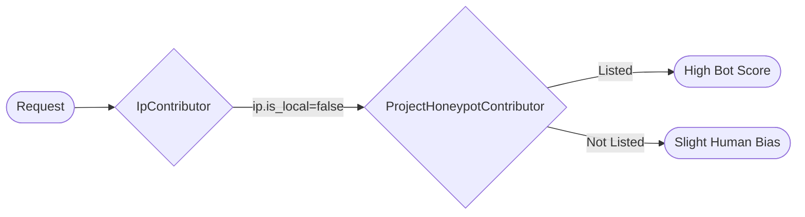

# Project Honeypot Integration

Project Honeypot (HTTP:BL) integration provides IP reputation checking against a crowdsourced database of known
malicious actors, email harvesters, and comment spammers.

## Overview

[Project Honeypot](https://www.projecthoneypot.org/) maintains a DNS-based blocklist (HTTP:BL) that tracks:

- **Harvesters** - Bots that collect email addresses for spam lists
- **Comment Spammers** - Bots that post spam comments on websites
- **Suspicious IPs** - IPs that have exhibited suspicious behavior

The `ProjectHoneypotContributor` runs in **Wave 1** (after basic IP analysis) and performs DNS lookups to check visitor
IPs.



## Quick Start

### 1. Get a Free API Key

Sign up at [Project Honeypot](https://www.projecthoneypot.org/httpbl_configure.php) to get your 12-character access key.

### 2. Configure via User Secrets (Recommended)

```bash
dotnet user-secrets set "BotDetection:ProjectHoneypot:AccessKey" "your12charkey"
```

### 3. Enable in Configuration

```json
{
  "BotDetection": {
    "ProjectHoneypot": {
      "Enabled": true,
      "AccessKey": null,
      "HighThreatThreshold": 25,
      "MaxDaysAge": 90,
      "SkipLocalIps": true
    }
  }
}
```

## How It Works

### HTTP:BL DNS Query

The contributor builds a DNS query in the format:

```
[AccessKey].[Reversed IP].dnsbl.httpbl.org
```

For example, checking IP `192.168.1.100`:

```
your12charkey.100.1.168.192.dnsbl.httpbl.org
```

### DNS Response

A response of `127.x.y.z` indicates the IP is listed:

| Octet        | Meaning                           |
|--------------|-----------------------------------|
| `127`        | Valid response marker             |
| `x` (Days)   | Days since last activity (0-255)  |
| `y` (Threat) | Threat score (0-255, logarithmic) |
| `z` (Type)   | Visitor type bitfield             |

### Visitor Type Bitfield

| Bit | Value | Type                         |
|-----|-------|------------------------------|
| 0   | 1     | Suspicious                   |
| 1   | 2     | Harvester                    |
| 2   | 4     | Comment Spammer              |
| -   | 0     | Search Engine (special case) |

Combinations are possible (e.g., `3` = Suspicious + Harvester).

### Example Response

Response `127.5.75.6`:

- `5` days since last activity
- `75` threat score
- `6` = Harvester (2) + Comment Spammer (4)

## Configuration

### Full Configuration

```json
{
  "BotDetection": {
    "ProjectHoneypot": {
      "Enabled": true,
      "AccessKey": null,
      "HighThreatThreshold": 25,
      "MaxDaysAge": 90,
      "TimeoutMs": 1000,
      "CacheDurationSeconds": 1800,
      "SkipLocalIps": true,
      "TreatHarvestersAsMalicious": true,
      "TreatCommentSpammersAsMalicious": true,
      "TreatSuspiciousAsSuspicious": true
    }
  }
}
```

| Option                            | Type   | Default | Description                              |
|-----------------------------------|--------|---------|------------------------------------------|
| `Enabled`                         | bool   | `false` | Enable Project Honeypot checks           |
| `AccessKey`                       | string | `null`  | Your 12-character HTTP:BL access key     |
| `HighThreatThreshold`             | int    | `25`    | Threat score triggering verified bad bot |
| `MaxDaysAge`                      | int    | `90`    | Ignore entries older than this           |
| `TimeoutMs`                       | int    | `1000`  | DNS lookup timeout                       |
| `CacheDurationSeconds`            | int    | `1800`  | Cache duration for lookups (30 min)      |
| `SkipLocalIps`                    | bool   | `true`  | Skip localhost/private IPs               |
| `TreatHarvestersAsMalicious`      | bool   | `true`  | Mark harvesters as malicious bots        |
| `TreatCommentSpammersAsMalicious` | bool   | `true`  | Mark spammers as malicious bots          |
| `TreatSuspiciousAsSuspicious`     | bool   | `true`  | Mark suspicious as bot                   |

## Detection Output

### Search Engines

If the IP is identified as a search engine (type = 0), it receives a positive bias:

```csharp
DetectionContribution.VerifiedGoodBot(
    Name, "Search Engine (Project Honeypot)",
    "IP verified as search engine by Project Honeypot")
```

### High Threat Scores

IPs with threat scores >= `HighThreatThreshold` trigger verified bad bot:

```csharp
DetectionContribution.VerifiedBadBot(
    Name,
    $"Honeypot Threat ({visitorType})",
    reason,
    BotType.MaliciousBot)
    with
    {
        ConfidenceDelta = confidence,
        Weight = 1.8  // High weight for verified threats
    }
```

### Lower Threat Scores

IPs with lower scores get a proportional bot contribution:

```csharp
DetectionContribution.Bot(
    Name, "ProjectHoneypot",
    confidence,
    reason,
    botType,
    weight: 1.5)
```

### Not Listed

IPs not in the database get a slight human bias:

```csharp
new DetectionContribution
{
    ConfidenceDelta = -0.05,  // Slight human signal
    Weight = 0.8,
    Reason = "IP not listed in Project Honeypot database"
}
```

## Confidence Calculation

Confidence is calculated based on threat score, recency, and visitor type:

### Base Confidence (Threat Score)

| Threat Score | Base Confidence |
|--------------|-----------------|
| >= 100       | 0.95            |
| >= 50        | 0.85            |
| >= 25        | 0.70            |
| >= 10        | 0.55            |
| >= 5         | 0.40            |
| < 5          | 0.30            |

### Age Factor (Recency)

| Days Since Last Activity | Factor |
|--------------------------|--------|
| 0 (today)                | 1.0    |
| 1-7 (last week)          | 0.95   |
| 8-30 (last month)        | 0.85   |
| 31-90 (last quarter)     | 0.70   |
| 91-180 (last 6 months)   | 0.50   |
| > 180                    | 0.30   |

### Type Factor (Severity)

| Visitor Type    | Multiplier |
|-----------------|------------|
| Comment Spammer | 1.1        |
| Harvester       | 1.15       |
| Suspicious      | 1.05       |

Final confidence: `min(base × age × type, 0.99)`

## Signals Emitted

| Signal Key                     | Type   | Description                        |
|--------------------------------|--------|------------------------------------|
| `honeypot.checked`             | bool   | True if honeypot was queried       |
| `honeypot.listed`              | bool   | True if IP is in database          |
| `honeypot.threat_score`        | int    | Threat score (0-255)               |
| `honeypot.visitor_type`        | string | Visitor type flags                 |
| `honeypot.days_since_activity` | int    | Days since last activity           |
| `HoneypotTestMode`             | bool   | True if using test mode simulation |

## Caching

Lookups are cached for 30 minutes by default to:

- Reduce DNS queries
- Improve response times
- Avoid rate limiting

```csharp
// Cache structure
private static readonly ConcurrentDictionary<string, (HoneypotResult Result, DateTime Expires)> _cache = new();
private static readonly TimeSpan CacheDuration = TimeSpan.FromMinutes(30);
```

## Testing

### Test Mode Simulation

For testing without real DNS lookups, use special User-Agent markers:

```
<test-honeypot:harvester>
<test-honeypot:spammer>
<test-honeypot:suspicious>
```

### Demo UI

Use the demo application's honeypot buttons:

```bash
dotnet run --project Mostlylucid.BotDetection.Demo
# Visit http://localhost:5000/bot-test
# Click "Honeypot: Harvester", "Honeypot: Spammer", or "Honeypot: Suspicious"
```

### Test Mode Headers

```bash
# Test harvester simulation
curl http://localhost:5000/bot-detection/check \
  -H "ml-bot-test-mode: honeypot-harvester"

# Test spammer simulation
curl http://localhost:5000/bot-detection/check \
  -H "ml-bot-test-mode: honeypot-spammer"

# Test suspicious simulation
curl http://localhost:5000/bot-detection/check \
  -H "ml-bot-test-mode: honeypot-suspicious"
```

### Test Mode Response Values

| Test Type    | Threat Score | Days Ago | Visitor Type   |
|--------------|--------------|----------|----------------|
| `harvester`  | 75           | 3        | Harvester      |
| `spammer`    | 100          | 1        | CommentSpammer |
| `suspicious` | 35           | 14       | Suspicious     |

## Integration Tests

```csharp
[Theory]
[InlineData("<test-honeypot:harvester>", "Harvester", 75)]
[InlineData("<test-honeypot:spammer>", "CommentSpammer", 100)]
[InlineData("<test-honeypot:suspicious>", "Suspicious", 35)]
public async Task ProjectHoneypotContributor_SimulatesHoneypotFromTestMarker(
    string testUserAgent, string expectedType, int expectedThreatScore)
{
    var c = GetContributor("ProjectHoneypot");
    var ctx = new DefaultHttpContext();
    ctx.Request.Headers.UserAgent = testUserAgent;

    var result = await c.ContributeAsync(state);

    Assert.Contains("[TEST MODE]", result.First().Reason);
    Assert.Equal(expectedThreatScore, result.First().Signals[SignalKeys.HoneypotThreatScore]);
}
```

## Production Security

The contributor is designed with security in mind:

| Default                | Production Recommendation    |
|------------------------|------------------------------|
| `Enabled`: `false`     | Requires explicit API key    |
| `SkipLocalIps`: `true` | Never queries localhost      |
| No cached key leakage  | Access key only in DNS query |

## Limitations

- **IPv4 only** - HTTP:BL does not support IPv6
- **DNS-based** - Subject to DNS latency (~100ms)
- **Rate limits** - Project Honeypot may rate limit excessive queries
- **Staleness** - Data may be days/weeks old

## Best Practices

### Do

- Get your own free API key
- Use user secrets for the access key
- Set appropriate `HighThreatThreshold` for your use case
- Cache results aggressively

### Don't

- Commit access keys to source control
- Ignore rate limiting
- Skip local IPs in production (keep `SkipLocalIps: true`)
- Rely solely on honeypot data (use with other detectors)

## See Also

- [IP Detection](ip-detection.md) - Basic IP analysis
- [Security Tools Detection](security-tools-detection.md) - Security scanner detection
- [Detection Strategies](detection-strategies.md) - Overall detection architecture
- [Learning and Reputation](learning-and-reputation.md) - How detections feed the learning system
