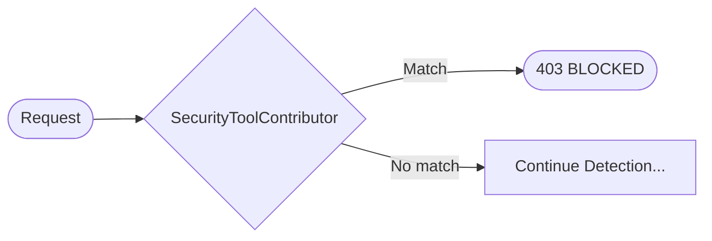

# Security Tools Detection

The Security Tools detector identifies penetration testing tools, vulnerability scanners, and exploit frameworks based
on User-Agent patterns. This provides immediate blocking of known malicious scanning activity.

## Overview

Security tools typically identify themselves in their User-Agent strings, making them easy to detect. The
`SecurityToolContributor` runs in **Wave 0** (first wave, no dependencies) with high priority to enable instant abort
before expensive analysis runs.



## Quick Start

Security tool detection is **enabled by default** and requires no configuration:

```json
{
  "BotDetection": {
    "SecurityTools": {
      "Enabled": true,
      "BlockSecurityTools": true,
      "LogDetections": true
    }
  }
}
```

## How It Works

### Pattern Sources

Patterns are fetched from external sources (no hardcoded lists) via the background update service:

| Source                                                                            | Description                              |
|-----------------------------------------------------------------------------------|------------------------------------------|
| [digininja/scanner_user_agents](https://github.com/digininja/scanner_user_agents) | JSON with tool metadata (name, category) |
| [OWASP CoreRuleSet](https://github.com/coreruleset/coreruleset)                   | Regex patterns from WAF rules            |

Patterns are refreshed every 24 hours by default.

### Pattern Matching

The contributor supports two matching modes:

1. **Regex patterns** - Compiled with `RegexOptions.IgnoreCase` and 100ms timeout
2. **Substring matching** - Case-insensitive `Contains()` check (fallback for invalid regex)

```csharp
// Example matching flow
foreach (var pattern in patterns)
{
    if (pattern.CompiledRegex != null)
    {
        matched = pattern.CompiledRegex.IsMatch(userAgent);
    }
    else
    {
        matched = userAgent.Contains(pattern.Pattern, StringComparison.OrdinalIgnoreCase);
    }
}
```

### Detection Output

When a security tool is detected, the contributor returns a `VerifiedBadBot` contribution:

```csharp
DetectionContribution.VerifiedBadBot(
    Name,                    // "SecurityTool"
    toolName,                // e.g., "Nikto"
    reason,                  // e.g., "Security/hacking tool detected: Nikto (Category: Scanner)"
    BotType.MaliciousBot)
    with
    {
        ConfidenceDelta = 0.95,
        Weight = 2.0,  // High weight for definitive detection
        Signals = ...
    }
```

## Detected Tools

The detector identifies tools across multiple categories:

### Vulnerability Scanners

| Tool         | Example User-Agent                                             |
|--------------|----------------------------------------------------------------|
| **Nikto**    | `Mozilla/5.00 (Nikto/2.1.6) (Evasions:None) (Test:Port Check)` |
| **Nessus**   | `Nessus SOAP`                                                  |
| **Acunetix** | `Acunetix Web Vulnerability Scanner`                           |
| **OpenVAS**  | `OpenVAS/9.0`                                                  |
| **Qualys**   | `Qualys, Cloud Platform`                                       |

### Penetration Testing Tools

| Tool           | Example User-Agent                                                                |
|----------------|-----------------------------------------------------------------------------------|
| **Nmap**       | `Mozilla/5.0 (compatible; Nmap Scripting Engine; https://nmap.org/book/nse.html)` |
| **Burp Suite** | `Mozilla/5.0 Burp/2023.10`                                                        |
| **OWASP ZAP**  | `Mozilla/5.0 (Windows; U) OWASP/3.4.0 ZAP/2.12`                                   |
| **Metasploit** | `Metasploit/4.x`                                                                  |

### SQL Injection Tools

| Tool       | Example User-Agent               |
|------------|----------------------------------|
| **sqlmap** | `sqlmap/1.7 (http://sqlmap.org)` |
| **Havij**  | `Havij/1.x`                      |

### Web Scrapers and Fuzzers

| Tool          | Example User-Agent   |
|---------------|----------------------|
| **Gobuster**  | `gobuster/3.x`       |
| **Dirbuster** | `DirBuster-1.x`      |
| **wfuzz**     | `Wfuzz/2.x`          |
| **ffuf**      | `Fuzz Faster U Fool` |

## Configuration

### Full Configuration

```json
{
  "BotDetection": {
    "SecurityTools": {
      "Enabled": true,
      "BlockSecurityTools": true,
      "LogDetections": true,
      "CustomPatterns": [
        "MyInternalScanner/",
        "CustomTool/v\\d+"
      ],
      "ExcludedPatterns": [
        "AllowedScanner/1.0"
      ],
      "EnabledCategories": [],
      "HoneypotRedirectUrl": null
    }
  }
}
```

| Option                | Type     | Default | Description                                        |
|-----------------------|----------|---------|----------------------------------------------------|
| `Enabled`             | bool     | `true`  | Enable security tool detection                     |
| `BlockSecurityTools`  | bool     | `true`  | Block detected security tools (403 response)       |
| `LogDetections`       | bool     | `true`  | Log detected security tools to warning log         |
| `CustomPatterns`      | string[] | `[]`    | Additional patterns to detect (regex or substring) |
| `ExcludedPatterns`    | string[] | `[]`    | Patterns to exclude from detection                 |
| `EnabledCategories`   | string[] | `[]`    | Limit to specific categories (empty = all)         |
| `HoneypotRedirectUrl` | string   | `null`  | Redirect detected tools to honeypot (future)       |

### Custom Patterns

Add your own patterns for internal or custom tools:

```json
{
  "BotDetection": {
    "SecurityTools": {
      "CustomPatterns": [
        "MyCompanyScanner/",
        "InternalPenTest/\\d+\\.\\d+",
        "CustomFuzzer"
      ]
    }
  }
}
```

### Excluding Patterns

Allow specific tools (e.g., for authorized security testing):

```json
{
  "BotDetection": {
    "SecurityTools": {
      "ExcludedPatterns": [
        "AuthorizedScanner/1.0",
        "InternalMonitor"
      ]
    }
  }
}
```

## Signals Emitted

When a security tool is detected, the following signals are added to the blackboard:

| Signal Key               | Type   | Description                          |
|--------------------------|--------|--------------------------------------|
| `security_tool.detected` | bool   | True if a security tool was detected |
| `security_tool.name`     | string | Name of the detected tool            |
| `security_tool.category` | string | Category (Scanner, Fuzzer, etc.)     |
| `useragent`              | string | The full User-Agent string           |
| `useragent.is_bot`       | bool   | Always `true` for security tools     |
| `useragent.bot_type`     | string | `"MaliciousBot"`                     |
| `useragent.bot_name`     | string | Tool name                            |

## Testing

### Demo UI

Use the demo application's security scanner buttons to test detection:

```bash
dotnet run --project Mostlylucid.BotDetection.Demo
# Visit http://localhost:5000/bot-test
# Click "Nikto", "Nessus", "Nmap", "Burp Suite", or "Acunetix" buttons
```

### Test Mode Headers

Test detection using the `ml-bot-test-mode` header:

```bash
# Test Nikto detection
curl http://localhost:5000/bot-detection/check \
  -H "ml-bot-test-mode: nikto"

# Test Nmap detection
curl http://localhost:5000/bot-detection/check \
  -H "ml-bot-test-mode: nmap"

# Test Burp Suite detection
curl http://localhost:5000/bot-detection/check \
  -H "ml-bot-test-mode: burpsuite"
```

### Custom User-Agent Testing

```bash
# Test with custom User-Agent
curl http://localhost:5000/bot-detection/check \
  -H "User-Agent: sqlmap/1.7 (http://sqlmap.org)"

curl http://localhost:5000/bot-detection/check \
  -H "User-Agent: Mozilla/5.00 (Nikto/2.1.6)"
```

## Integration with Other Detectors

The SecurityToolContributor integrates with the blackboard orchestrator:

```
Wave 0 (parallel):
├── SecurityToolContributor (Priority 8)
├── UserAgentContributor (Priority 10)
├── HeaderContributor (Priority 10)
└── IpContributor (Priority 10)

If SecurityTool detects → TriggerEarlyExit = true → Skip remaining waves
```

### Early Exit Behavior

Security tool detection triggers early exit when:

1. A pattern matches
2. `BlockSecurityTools` is `true`
3. The contribution has `TriggerEarlyExit = true`

This prevents wasted computation on known-malicious requests.

## Logging

Security tool detections are logged at Warning level:

```
warn: Mostlylucid.BotDetection.Orchestration.ContributingDetectors.SecurityToolContributor[0]
      Security tool detected: Nikto (Category: Scanner) from IP: 192.168.1.100
```

Enable debug logging for pattern loading:

```json
{
  "Logging": {
    "LogLevel": {
      "Mostlylucid.BotDetection.Orchestration.ContributingDetectors.SecurityToolContributor": "Debug"
    }
  }
}
```

## Metrics

The following OpenTelemetry metrics are available:

```csharp
bot_detection_security_tool_detections_total    // Counter: total detections
bot_detection_security_tool_patterns_loaded     // Gauge: patterns in cache
bot_detection_security_tool_detection_duration  // Histogram: detection latency
```

## Best Practices

### Do

- Keep `BlockSecurityTools` enabled in production
- Review logs regularly for new tool signatures
- Add custom patterns for tools specific to your industry
- Use exclusions sparingly and document them

### Don't

- Disable security tool detection in production
- Ignore detection logs
- Add overly broad exclusion patterns
- Assume all security tools are malicious (some may be authorized)

## See Also

- [User-Agent Detection](user-agent-detection.md) - General bot detection from UA
- [Detection Strategies](detection-strategies.md) - Overall detection architecture
- [Learning and Reputation](learning-and-reputation.md) - How detections feed the learning system
