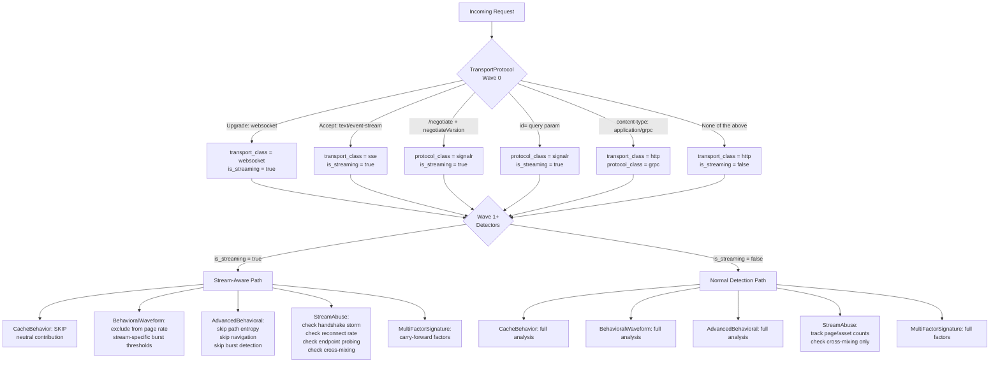
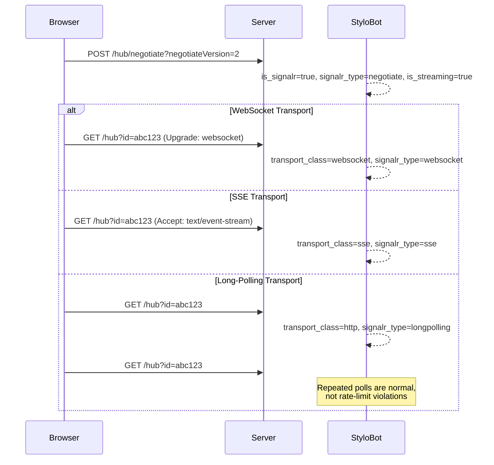

# Stream Transport Detection

WebSocket, Server-Sent Events (SSE), and SignalR traffic follows fundamentally different patterns than standard HTTP page loads. Without stream-aware detection, these patterns cause false positives: high request count, odd paths, missing cache headers, and timing regularity are all normal for streaming but suspicious for page loads.

StyloBot implements a **two-level transport classification** system that identifies streaming traffic early and propagates that classification to all downstream detectors. A dedicated **StreamAbuseContributor** then catches attackers who hide behind streaming traffic.

## Architecture

Two detectors work together:

- **TransportProtocolContributor** (Wave 0, priority 5) — classifies every request into a transport class and protocol class, emitting `transport.is_streaming` for downstream consumption
- **StreamAbuseContributor** (Wave 1+, priority 35) — uses per-signature sliding window tracking to detect abuse patterns unique to streaming

Five existing detectors consume the streaming signals to suppress false positives:

- **CacheBehaviorContributor** — skips cache validation checks entirely for streaming requests
- **BehavioralWaveformContributor** — excludes streaming requests from page rate/burst calculations, applies stream-specific burst thresholds
- **AdvancedBehavioralContributor** — skips path entropy, navigation pattern, and burst analysis for streaming
- **MultiFactorSignatureService** — prevents streaming requests from polluting full-page-load signature factors

## Request Flow by Transport Type



## Two-Level Transport Classification

TransportProtocolContributor emits two classification levels for every request:

### Level 1: Transport Class

The physical transport mechanism:

| Value | Detected By | Example |
|-------|------------|---------|
| `http` | Default (no streaming headers) | Regular page loads, API calls, gRPC |
| `websocket` | `Upgrade: websocket` + `Connection: Upgrade` | SignalR WebSocket, custom WS |
| `sse` | `Accept: text/event-stream` | EventSource API, SignalR SSE fallback |

### Level 2: Protocol Class

The application-level protocol:

| Value | Detected By | Example |
|-------|------------|---------|
| `signalr` | `/negotiate` + `negotiateVersion` query param, or `id=` query param | ASP.NET SignalR hub connections |
| `grpc` | `content-type: application/grpc*` | gRPC and gRPC-web |
| `api` | GraphQL path patterns | GraphQL endpoints |
| `unknown` | None of the above | Standard HTTP, custom protocols |

### Composite Signal: `transport.is_streaming`

`true` when the transport class is `websocket` or `sse`, OR when SignalR is detected (including long-polling, which uses plain HTTP). This is the primary signal consumed by downstream detectors.

## SignalR Detection

SignalR uses three transports with a negotiation handshake. All are detected generically based on the protocol spec (no site-specific paths):



**Detection rules** (generic, not site-specific):
- **Negotiate**: POST + path ends `/negotiate` + `negotiateVersion` in query string
- **Connect**: Any request with `id=` in query string (connection token from negotiate)

## SSE Reconnect Detection

When an SSE connection drops, the browser automatically reconnects with `Last-Event-ID` to resume from where it left off. TransportProtocolContributor detects this:

| Signal | Type | Description |
|--------|------|-------------|
| `transport.sse_reconnect` | boolean | `true` when `Last-Event-ID` header is present |
| `transport.sse_last_event_id` | string | The Last-Event-ID value |

A `Last-Event-ID` of `0` or `-1` triggers a bot signal (history replay attempt — requesting all events from the beginning).

## Stream Abuse Detection

StreamAbuseContributor runs in Wave 1+ (after TransportProtocol and BehavioralWaveform emit signals). It uses `IMemoryCache` for per-signature sliding window tracking.

### Abuse Patterns Detected

#### 1. Handshake Storm

Excessive WebSocket upgrade requests from a single signature in a short window.

| Parameter | Default | Description |
|-----------|---------|-------------|
| `handshake_storm_threshold` | 10 | Max upgrades before flagging |
| `handshake_storm_window_seconds` | 60 | Sliding window size |
| `handshake_storm_confidence` | 0.65 | Bot confidence when triggered |

**Why it matters**: Connection flooding exhausts server resources (each WS upgrade holds a connection). Normal SignalR reconnects produce 1-3 upgrades per disconnect event.

#### 2. Cross-Endpoint Mixing

The most important signal: a signature that mixes streaming traffic with page-scraping behavior. Legitimate users who use WebSocket also load assets (CSS, JS, images). Attackers who use WebSocket as cover tend to scrape pages without loading assets.

| Parameter | Default | Description |
|-----------|---------|-------------|
| `cross_endpoint_mixing_min_stream_requests` | 3 | Min stream requests to consider |
| `cross_endpoint_mixing_min_page_requests` | 5 | Min page requests to consider |
| `cross_endpoint_mixing_max_asset_ratio` | 0.2 | Max asset ratio before flagging (below = scraping) |
| `cross_endpoint_mixing_confidence` | 0.6 | Bot confidence when triggered |

**Detection logic**: Only fires when BOTH conditions are true:
1. Signature has significant streaming traffic (≥3 requests)
2. Signature has significant page traffic (≥5 requests) with low asset ratio (<20%)

This prevents false positives on legitimate dashboard users who have both WebSocket connections and normal page browsing with assets.

#### 3. SSE Reconnect Rate

Excessive SSE reconnects from broken EventSource implementations or deliberate abuse.

| Parameter | Default | Description |
|-----------|---------|-------------|
| `sse_reconnect_rate_threshold` | 20 | Max reconnects per window |
| `sse_reconnect_rate_window_seconds` | 60 | Sliding window size |
| `sse_reconnect_confidence` | 0.5 | Bot confidence when triggered |

#### 4. Concurrent Streams

A signature connecting to many distinct streaming endpoints (probing for open streams).

| Parameter | Default | Description |
|-----------|---------|-------------|
| `concurrent_streams_threshold` | 5 | Max distinct stream paths |
| `concurrent_streams_confidence` | 0.45 | Bot confidence when triggered |

### Signals Emitted

| Signal Key | Type | Description |
|---|---|---|
| `stream.abuse_checked` | boolean | Analysis was performed |
| `stream.handshake_storm` | boolean | WebSocket handshake storm detected |
| `stream.cross_endpoint_mixing` | boolean | Streaming + scraping mixing detected |
| `stream.reconnect_rate` | double | SSE reconnect rate |
| `stream.concurrent_streams` | int | Distinct streaming endpoint count |

## Downstream Detector Behavior Changes

### CacheBehaviorContributor

**Before**: Wave 0, no streaming awareness. Penalized missing `If-None-Match`/`If-Modified-Since` and rapid repeat requests — both normal for SSE and SignalR.

**After**: Moved to Wave 1 (triggered by `transport.protocol`). Reads `transport.is_streaming` and returns a neutral contribution immediately for streaming requests, emitting `cache.skipped_streaming = true`.

### BehavioralWaveformContributor

**Before**: Only excluded WebSocket from page rate calculations and burst detection.

**After**:
- `ContentClass` enum extended with `SSE = 4` and `SignalR = 5`
- `ClassifyRequest()` detects SSE (via `Accept: text/event-stream`) and SignalR (via path/query patterns)
- All rate/burst filters exclude SSE and SignalR alongside WebSocket
- Stream-specific burst thresholds:
  - WebSocket: 20+ in 10s (existing)
  - SSE: 30+ in 10s (reconnect storms)
  - SignalR: 40+ in 10s (long-poll is inherently high-frequency)
- `ClassifyResponseContentType()` maps `text/event-stream` to `ContentClass.SSE`

### AdvancedBehavioralContributor

**Before**: Only skipped path entropy, navigation pattern, and burst detection for WebSocket.

**After**: Inline detection expanded to cover SSE (`Accept: text/event-stream`) and SignalR (path/query patterns). All skip guards use the composite `isStreaming` flag. Timing analysis (entropy, regularity, anomaly) still applies — machine-gun reconnects at exact intervals are still suspicious regardless of transport.

### MultiFactorSignatureService

**Before**: `IsNonDocumentRequest()` detected WebSocket and had SSE in a fallback Accept header check.

**After**: Explicit early checks for SSE (`Accept: text/event-stream`), SignalR negotiate (`/negotiate` + `negotiateVersion`), and SignalR connect (`id=` query param) — all before the `Sec-Fetch-Dest` check. Prevents streaming requests from generating new signature factors.

## Configuration

All parameters are configurable via `appsettings.json`:

```json
{
  "BotDetection": {
    "Detectors": {
      "StreamAbuseContributor": {
        "Parameters": {
          "handshake_storm_threshold": 10,
          "handshake_storm_window_seconds": 60,
          "cross_endpoint_mixing_min_stream_requests": 3,
          "cross_endpoint_mixing_min_page_requests": 5,
          "cross_endpoint_mixing_max_asset_ratio": 0.2,
          "sse_reconnect_rate_threshold": 20,
          "concurrent_streams_threshold": 5,
          "cache_sliding_expiration_seconds": 300
        }
      }
    }
  }
}
```

## Scenarios

### Legitimate SignalR Dashboard User
1. Browser navigates to dashboard page (Page request)
2. Browser loads CSS, JS, images (Asset requests)
3. SignalR negotiate POST fires → `is_signalr=true`, `is_streaming=true`
4. WebSocket upgrade → CacheBehavior skips, BehavioralWaveform excludes from rate
5. Periodic long-poll if WS unavailable → not penalized
6. Cross-endpoint mixing check: asset ratio > 20% → **no flag**

### SSE Reconnect Chain
1. Browser connects with `Accept: text/event-stream` → `transport_class=sse`, `is_streaming=true`
2. Connection drops, browser reconnects with `Last-Event-ID: 42` → `sse_reconnect=true`
3. CacheBehavior skips (streaming), BehavioralWaveform excludes from burst count
4. If reconnects < 20/min → normal, no flag
5. If reconnects ≥ 20/min → StreamAbuse SSE reconnect rate fires

### Attacker Using WebSocket as Cover
1. Bot opens WebSocket connection to appear legitimate
2. Bot also scrapes pages (HTML only, no CSS/JS/images loaded)
3. StreamAbuse sees: `stream_requests ≥ 3` AND `page_requests ≥ 5` AND `asset_ratio < 20%`
4. Cross-endpoint mixing fires → **bot flagged**

### WebSocket Connection Flooding
1. Bot sends 15+ WebSocket upgrades per minute
2. BehavioralWaveform flags excessive WS upgrade rate (>15/min)
3. If 10+ upgrades in 60s → StreamAbuse handshake storm fires
4. If 20+ upgrades in 10s → BehavioralWaveform WS burst fires

## Wave Execution for Streaming Requests

```mermaid
flowchart LR
    subgraph W0["Wave 0 (parallel)"]
        TP[TransportProtocol]
        UA[UserAgent]
        HD[Header]
        IP[IP]
        ST[SecurityTool]
        OTHER[... other Wave 0]
    end

    subgraph W1["Wave 1 (triggered)"]
        CB[CacheBehavior<br/>→ SKIP streaming]
        BW[BehavioralWaveform<br/>→ stream-aware rates]
        AB[AdvancedBehavioral<br/>→ skip path/nav/burst]
        SA[StreamAbuse<br/>→ abuse patterns]
        IC[Inconsistency]
        VA[VersionAge]
    end

    subgraph W2["Wave 2+"]
        ML[MultiLayerCorrelation]
        HE[Heuristic]
        SIM[Similarity]
        HL[HeuristicLate]
    end

    W0 -->|transport.protocol<br/>transport.is_streaming<br/>waveform.signature| W1
    W1 --> W2
```



## Files

| File | Role |
|------|------|
| `ContributingDetectors/TransportProtocolContributor.cs` | Two-level classification, SignalR detection |
| `ContributingDetectors/StreamAbuseContributor.cs` | Stream abuse detection (new) |
| `Manifests/detectors/transport-protocol.detector.yaml` | TransportProtocol YAML manifest |
| `Manifests/detectors/stream-abuse.detector.yaml` | StreamAbuse YAML manifest |
| `ContributingDetectors/CacheBehaviorContributor.cs` | Stream skip logic |
| `ContributingDetectors/BehavioralWaveformContributor.cs` | ContentClass SSE/SignalR, stream-aware rates |
| `ContributingDetectors/AdvancedBehavioralContributor.cs` | Streaming guards |
| `Dashboard/MultiFactorSignatureService.cs` | SSE/SignalR in IsNonDocumentRequest |
| `Models/DetectionContext.cs` | Signal key constants |
