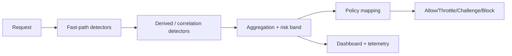

# Start Here

This is the operator-focused path for understanding and launching StyloBot.

## What StyloBot does

StyloBot analyzes each request across multiple detectors, combines those detector contributions into:

- Bot probability (`0.0` to `1.0`)
- Confidence (`0.0` to `1.0`)
- Risk band (`VeryLow`, `Low`, `Elevated`, `Medium`, `High`, `VeryHigh`)
- Recommended action (`Allow`, `Throttle`, `Challenge`, `Block`)

You keep policy control. StyloBot gives evidence, not black-box decisions.

## Why teams choose StyloBot

- Speed with intelligence: low-latency request decisions with explainable evidence.
- Signature-first identity: a visitor is represented as a zero-PII signature, not raw IP, UA, or location.
- Time-aware detection: behavior is evaluated across request history, not just single snapshots.
- Higher resolution outcomes: multi-vector fuzzy matching across time improves confidence on evasive traffic.
- Operator control: policy remains yours, including allow/challenge/throttle/block strategy.

## 5-minute quick path

1. Open `/Home/LiveDemo`
2. Open `/_stylobot` in a second tab
3. Call `/bot-detection/check` with a normal browser User-Agent and then a scraper-like User-Agent
4. Compare probability, risk, top reasons, and suggested action
5. Review detector contribution trends in the dashboard

## How request evaluation works

For a detailed walkthrough of this pipeline, read [How StyloBot Works](/docs/how-stylobot-works).

## Read next

- [Running Locally](/docs/running-locally): local setup and smoke tests
- [How StyloBot Works](/docs/how-stylobot-works): scoring, risk bands, policy flow
- [Detectors In Depth](/docs/detectors-in-depth): what each detector checks and how to tune it
- [Live Demo Guide](/docs/live-demo): how to present and interpret live output
- [Deploy on Server](/docs/deploy-on-server): practical production rollout
- [GitHub Docs Map](/docs/github-docs-map): deeper technical docs in the GitHub repo

## Safe rollout defaults

- Start in observe mode before taking blocking actions
- Tune on real traffic for at least one full traffic cycle
- Use path/policy-specific thresholds instead of one global aggressive threshold
- Keep secrets managed outside source control
