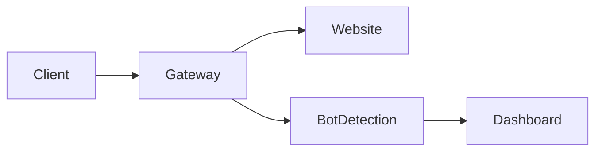

# Start Here

Welcome to Stylobot docs. This section is for people who want to run and use the product quickly.

## What Stylobot does

Stylobot helps you identify and respond to automated traffic (bots) using multiple signals, then lets you decide whether to allow, challenge, slow, or block those requests.

## Fastest path

1. Open the live demo page: `/Home/LiveDemo`
2. Open diagnostic endpoint: `/bot-detection/check`
3. Send one human-like request and one bot-like request
4. Compare scores and reasons

## Where to go next

- `running-locally`: local setup in under 10 minutes
- `live-demo`: how to interpret the demo output
- `deploy-on-server`: production-friendly deployment steps
- `frequently-asked-questions`: common decisions and troubleshooting

## Architecture at a glance

## Safety defaults

- Start in log/observe mode before blocking
- Keep bot thresholds conservative while tuning
- Use non-production keys for local testing
