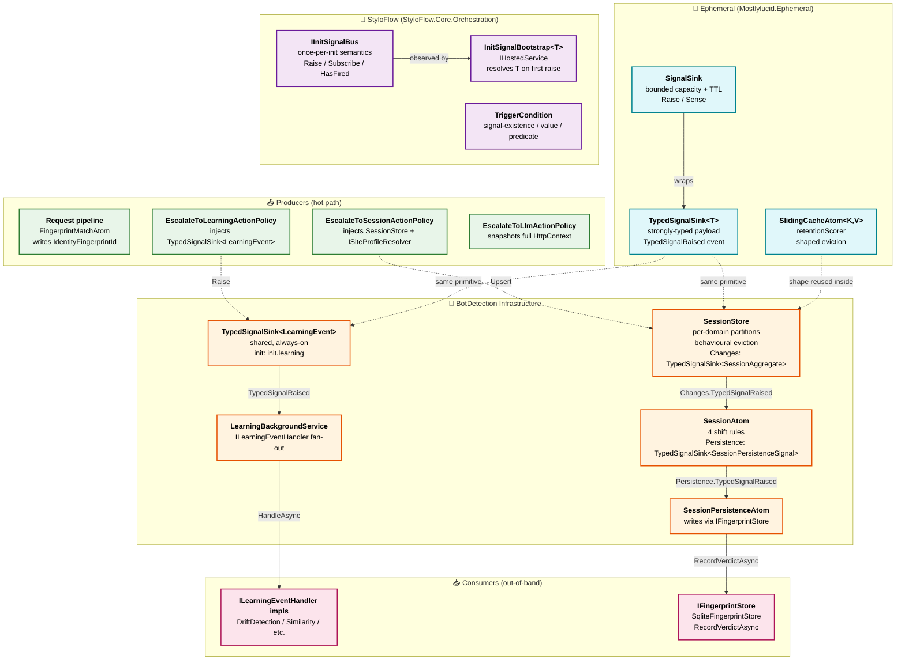
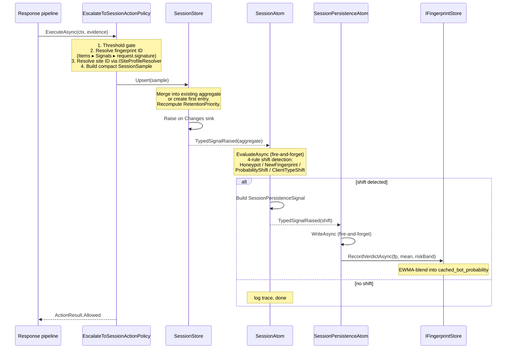

# Sink + Coordinator Ephemeral Architecture

Detailed reference for the sink-driven, dormant-coordinator, init-signal-boot
model that replaced the previous coordinator-per-signature cache pattern.
Read before touching any of: escalators, session-scope processing,
`SessionStore`, `SessionAtom`, `SessionPersistenceAtom`, learning fabric
producers/consumers, or the `IInitSignalBus` primitive.

## Guiding principles

1. **Sinks are boot-time infrastructure. Coordinators are dormant consumers.**
   Never invert. A sink is cheap (allocated at boot, sized by options); a
   coordinator is expensive (subscriptions, background loops, in-memory
   state). Producers write to sinks unconditionally; the coordinator wakes
   up when its init signal fires.

2. **Every escalation goes through a signal, never a direct method call.**
   Escalators inject a `TypedSignalSink<T>` (or a store surface that raises
   one). No `ILearningCoordinator?` optional injection; no `LlmClassificationCoordinator?`
   optional injection; no `SessionSignatureResponseCoordinatorCache.GetOrCreateAsync`.
   The dependency graph flows one way: producers → sinks → coordinators.

3. **Session lifetime is TTL on signals, not object lifecycle.**
   A "session" is the retention window of signals tagged with a resolved
   fingerprint ID on the shared per-domain session store. There is no
   `SessionCoordinator` instance to construct, evict, or race. When the
   last signal ages off, the session is over.

4. **Eviction is behavioural, not FIFO / LFU.** Under pressure, the
   session store keeps low-confidence-still-learning aggregates and evicts
   confidently-classified ones first. Priority function lives on the
   aggregate; retention sweeps read it in O(1).

5. **Persistence is a subscriber, not a call chain.** The atom that writes
   to `IFingerprintStore` subscribes to persistence signals raised by the
   session atom. It never appears in the escalator's dependency graph.

## Layer diagram



## Lifecycle: how a session sample flows end-to-end



## Lifecycle: dormant coordinator boots on first raise

Before the StyloFlow primitive, coordinators either eager-registered at
boot (paying cost even when idle) or hid behind optional `?` DI parameters
(silently disabled features). The primitive makes dormancy explicit and
loud.

```mermaid
sequenceDiagram
    participant Host as IHost.StartAsync
    participant Bootstrap as InitSignalBootstrap&lt;T&gt;
    participant Bus as IInitSignalBus
    participant Producer as Producer (escalator, etc.)
    participant Coord as TCoordinator

    Host->>Bootstrap: StartAsync
    Bootstrap->>Bus: Subscribe("init.foo", ResolveCoordinator)
    Note over Bus: signal not yet fired,<br/>handler queued
    Note over Coord: not constructed yet
    Producer->>Bus: Raise("init.foo")
    Bus->>Bootstrap: invoke handler (once)
    Bootstrap->>Coord: sp.GetRequiredService<T>()
    Note over Coord: ctor runs -- subscribes to<br/>whatever sink it consumes<br/>and snapshots via Sense()<br/>to catch up
    Producer->>Producer: continue producing;<br/>coordinator observes going forward
```

Key invariants of `InitSignalBus`:

- Raise is idempotent: only the first call fires handlers; subsequent calls
  return `false`.
- `Subscribe` after the fire runs the handler immediately (mirrors "you
  missed the boot, but you still need to run").
- Handler exceptions are swallowed. One bad factory cannot poison others
  registered against the same signal.

## Component contracts

### `TypedSignalSink<T>` (Ephemeral)

- **Owns**: the payload stream. Bounded capacity + sliding retention.
- **Raise** is O(1); allocates one `SignalEvent<T>` record.
- **`TypedSignalRaised`** event: subscribers see every raise in registration
  order.
- **`Sense(predicate?)`** snapshots the retention window for late
  subscribers to catch up.
- **Never**: memoize (no factory), block, or persist. If you need durable
  storage, subscribe and write.

### `SessionStore` (BotDetection)

- **Owns**: per-`SiteProfile.Id` partitions of
  `ConcurrentDictionary<fingerprintId, SessionAggregate>`.
- **`Upsert(sample)`**: merge-or-create with `SessionAggregateMerge`;
  raises the merged aggregate on `Changes`.
- **`TryGet` / `SnapshotSite`**: read-only lookups; do not touch retention.
- **Cleanup loop**: fires every `CleanupInterval`; age-out pass (drops
  entries older than adaptive TTL) followed by overflow pass (drops
  lowest-priority entries above per-site cap).
- **Adaptive TTL**: linear interpolation between `Ttl` (idle) and
  `MinTtlUnderPressure` (at capacity). No hard cliff.

### `SessionAtom` (BotDetection)

- **Consumes**: `SessionStore.Changes.TypedSignalRaised`.
- **Emits**: `Persistence` sink carrying `SessionPersistenceSignal` on
  shift.
- **Four shift rules** (see `SessionShiftReason`):
  1. **Honeypot** -- every sample so far is a honeypot hit; always
     shift-worthy.
  2. **NewFingerprint** -- persisted store returns null, aggregate has
     ≥ `MinSamplesToPersist` samples.
  3. **ProbabilityShift** -- aggregate mean differs from persisted
     cached probability by more than `ProbabilityShiftDelta`.
  4. **ClientTypeShift** -- dominant client type disagrees with
     persisted `InferredClientType` (case-insensitive).
- **Stateless**: all state on aggregates. Multiple instances would be
  redundant, not harmful.

### `SessionPersistenceAtom` (BotDetection)

- **Consumes**: `SessionAtom.Persistence.TypedSignalRaised`.
- **Emits**: writes to `IFingerprintStore.RecordVerdictAsync` (EWMA-blend
  path). Optional dependency; hosts without a store degrade cleanly to
  log-only.
- **Risk band mapping** mirrors the request-path orchestrator so cached
  verdicts stay consistent.

### `EscalateToSessionActionPolicy` (BotDetection)

- **Injects**: `SessionStore`, optional `ISiteProfileResolver`.
- **Flow**: threshold gate → resolve fingerprint ID (three-tier fallback)
  → resolve site ID → build `SessionSample` → `Upsert`.
- **Never**: touch coordinator instances, per-request sinks, or the
  persisted fingerprint store directly.

### `EscalateToLlmActionPolicy` (BotDetection)

- **Injects**: optional `LlmClassificationCoordinator` (lazy-boot target
  once we migrate).
- **Payload**: `LlmClassificationRequest.PreBuiltRequestInfo` is a *full*
  HttpContext snapshot (headers with PII redaction, cookies with values
  scrubbed, IPs, protocol). Not a summary; the LLM path is contractually
  "everything".
- **Redaction contract**: `Authorization`, `Cookie`, `Set-Cookie`,
  `Proxy-Authorization`, `X-Api-Key*` → `<redacted>`. Non-sensitive
  headers pass through unchanged. Cookie names emitted, values dropped.

### `EscalateToLearningActionPolicy` (BotDetection)

- **Injects**: `TypedSignalSink<LearningEvent>` (shared).
- **Flow**: threshold gate → build `LearningEvent` from evidence + context
  → `sink.Raise(key, evt)`.
- **Init signal**: `LearningSignalSinkOptions.InitSignal` = `init.learning`.
  When wired to the StyloFlow primitive, the coordinator + dispatcher
  boot on the sink's first raise.

## Shared sinks catalogue

| Sink | Type | Retention | Init signal | Owner |
|------|------|-----------|-------------|-------|
| Learning fabric | `TypedSignalSink<LearningEvent>` | 4096 / 5 min (configurable) | `init.learning` | `LearningSignalSinkOptions` |
| Session aggregate changes | `TypedSignalSink<SessionAggregate>` | Store's TTL curve | (owned by `SessionStore`) | `SessionStoreOptions` |
| Session persistence shifts | `TypedSignalSink<SessionPersistenceSignal>` | 5 min | (owned by `SessionAtom`) | Internal |

Each sink is a DI singleton, allocated at boot, cheap to keep alive.

## The 3-level fingerprint (reference for session-layer code)

The request cycle resolves down L1 → L2 → L3 before session-scope code
runs. Session code sees a **single resolved fingerprint ID**, not "which
level."

- **L1** — UA + IP HMAC. Session-stable only (rotates on IP/UA change).
- **L2** — cross-session learned identity vector. Not a session-layer
  concern.
- **L3** — cross-session persistent identity anchor. Not a session-layer
  concern.

The escalator's fingerprint fallback chain (Items → evidence.Signals →
request.signature) reflects this: prefer the resolved identity, fall
through to the L1 signature only when nothing better resolved.

Session tag = whatever the request cycle produced. Do not attempt to
re-resolve in session-scope code.

## Shaped eviction: the retention priority formula

```csharp
// SessionAggregateMerge.ComputeRetentionPriority (excerpt)
var ambiguity = 1.0 - Math.Pow(2.0 * (meanBotProbability - 0.5), 2.0);
ambiguity = Math.Clamp(ambiguity, 0.0, 1.0);
var confidenceGap = 1.0 - Math.Clamp(latestConfidence, 0.0, 1.0);
var learning = ambiguity * confidenceGap;
var honeypotFloor = Math.Min(1.0, honeypotHits * 0.5);
return Math.Max(learning, honeypotFloor);
```

Visualisation:

```
priority
   1.0│                    ╭──────
      │                   ╱ honeypot floor
      │      ╭──╮
      │     ╱    ╲   learning peak
      │    ╱      ╲
      │   ╱        ╲
   0.0│──╯          ╰──╭──
      ├──────────────┴──────
       0.0    0.5    1.0
       ← confident human   confident bot →
```

Under pressure the store evicts from the bottom of the priority curve
first (confident classifications), keeping the top (uncertain identities
still being learned + honeypot trails).

## Sizing constraints

Three constraints, largest wins:

1. **Boot-latency bridge**: retention must span the wall time between
   escalator raise and coordinator ready. Relevant once lazy-boot lands.
2. **Slowest consumer tick**: persistence samplers, LFU drainers, dashboard
   aggregators batch on tick cadences. Retention must span the largest
   tick interval.
3. **Persistence sampling adequacy**: durable-storage samplers see a
   fraction of raises. `retention × throughput × sample-rate ≥ N` where
   `N` is the minimum useful corpus size.

Defaults (`LearningSignalSinkOptions`: 4096 capacity, 5 min retention;
`SessionStoreOptions`: 5% memory budget, 10 min TTL, 1 min under pressure)
are sized for a typical always-on gateway. Raise retention when adding
slower samplers.

## Anti-patterns (do not do these)

- **Do not inject `ILearningCoordinator?` into producers.** Inject the
  sink. Coordinator is a consumer.
- **Do not call `SessionSignatureResponseCoordinatorCache.GetOrCreateAsync`.**
  It is deleted. Session state is a shared per-domain store, not a
  coordinator-per-signature registry.
- **Do not construct per-request escalator atoms inside the orchestrator.**
  Escalators are `IActionPolicy` implementations that run in the action
  policy pipeline against a response.
- **Do not use `SlidingCacheAtom` for memoization on the hot path.** It is
  a retention-scored registry primitive; the "cache" name is legacy.
- **Do not per-fingerprint the session sink.** Millions of fingerprints ×
  per-fingerprint sinks does not scale. Shared per-domain with fingerprint
  tags.
- **Do not evict FIFO / LFU on the session store.** The retention priority
  function is behavioural. Overrides drop the point of the design.
- **Do not summarise the LLM path.** LLM escalator payload is the full
  HttpContext snapshot; the classifier needs everything.

## Migration status (as of this document)

Done:

- Learning fabric on shared sink + `TryRaiseLearning` retired.
- `SessionSignatureResponseCoordinatorCache`,
  `SessionSignatureResponseCoordinator`, `SessionSignatureEscalatorAtom`,
  and the three analysis lanes deleted.
- `SessionStore` + `SessionAtom` + `SessionPersistenceAtom` +
  `EscalateToSessionActionPolicy` in place.
- LLM escalator emits full HttpContext snapshot with redaction.
- `IInitSignalBus` primitive + `AddOnInitSignal<T>` DI helper in
  StyloFlow.Core 2.8.1, published to nuget.org.
- **Learning fabric** wired to lazy-boot on `init.learning`:
  `LearningCoordinator` + `LearningBackgroundService` construct on first
  escalator raise via `AddOnInitSignal<T>`. Sink factory fires init
  signal via `Interlocked.Exchange` guard on first `TypedSignalRaised`;
  dispatcher ctor `Sense()`s the retention window for catch-up.
- **Session atoms** wired to lazy-boot on `init.session`:
  `SessionAtom` + `SessionPersistenceAtom` lazy-construct on first
  `SessionStore.Upsert`; `SessionStore` itself stays eager (cleanup
  loop) but is the source of the init signal. `SessionAtom` ctor
  `Sense()`s `Changes` for catch-up.
- **LLM classification coordinator** wired to lazy-boot on `init.llm`:
  shared `TypedSignalSink<LlmClassificationRequest>` fronts the
  coordinator's bounded channel; `EscalateToLlmActionPolicy` injects
  the sink and raises directly. Coordinator ctor subscribes +
  catches up via `Sense()`, forwarding into the channel so LLM
  throttling is preserved. `LlmClassificationCoordinator.RequestSignal`
  is the named key.
- Wiring pinned by three test files that guarantee the "sink resolution
  does not fire init", "first raise fires", "subsequent raises don't
  re-fire", "AddOnInitSignal defers construction until first raise"
  contract for each fabric: `LearningInitSignalWiringTests` (4),
  `SessionInitSignalWiringTests` (4), `LlmInitSignalWiringTests` (4).

Deferred:

- **Intent classification coordinator** — `IntentClassificationCoordinator.TryEnqueue`
  is called from `IntentAtom` (a detector atom in the request path),
  not from an action policy escalator. Sink-front migration needs
  `IntentAtom` to change first — that's a detector-side refactor with
  broader impact. Coordinator stays eager-resolved in
  `BotDetectionHostedSingletonsBootstrap` with an in-code comment
  noting the migration path.
- **List updaters** (task #65) — ~30–40 services subscribe to
  `IScheduleCoordinator` ticks at ctor. The proposed refactor
  introduces a "TimerAtom" that emits tick signals + per-updater
  output sinks so consumers subscribe to updater state rather than
  polling the parasite stores (`BotListDatabase`, JA3 corpus, etc.).
  Lazy-boot doesn't apply because timer-driven updaters need to run
  on schedule regardless of consumer presence; value is in
  decoupling. Genuinely a distinct next phase.

Where to look:

- Sink primitive: `Mostlylucid.Ephemeral.TypedSignalSink<T>`.
- Init-signal primitive: `StyloFlow.Orchestration.IInitSignalBus`.
- BotDetection session code: `Mostlylucid.BotDetection/Orchestration/Sessions/`.
- Escalators: `Mostlylucid.BotDetection/Actions/EscalateTo*ActionPolicy.cs`.
- 3-level fingerprint memory: `reference_session_layer_and_fingerprint_levels.md`.